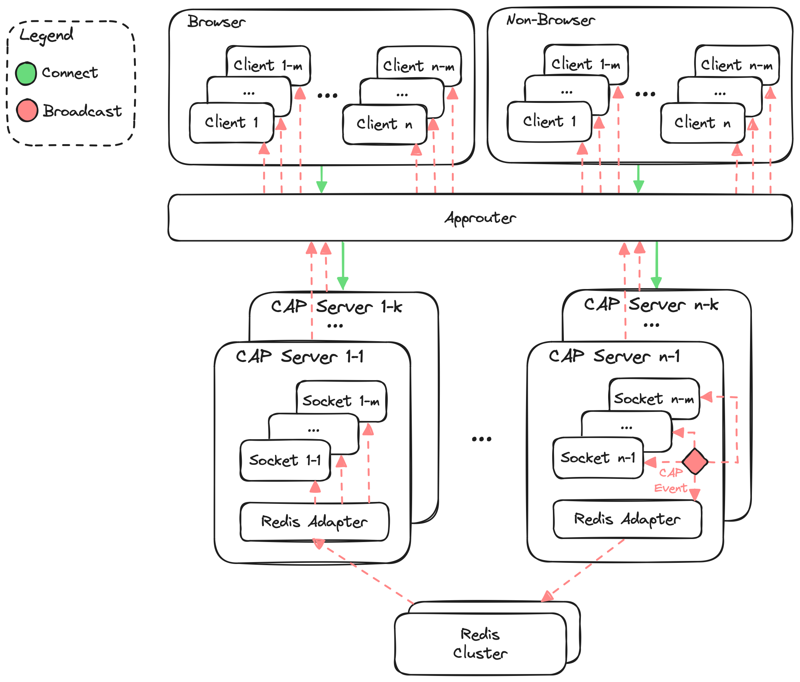

# @cap-js-community/websocket

[](https://www.npmjs.com/package/@cap-js-community/websocket)
[](https://www.npmjs.com/package/@cap-js-community/websocket)
[](https://api.reuse.software/info/github.com/cap-js-community/websocket)
[](https://github.com/cap-js-community/websocket/commits/main)

### [WebSocket adapter for CDS](https://www.npmjs.com/package/@cap-js-community/websocket)

> Exposes a WebSocket protocol via WebSocket standard or Socket.IO for CDS services.
> Runs in context of the [SAP Cloud Application Programming Model (CAP)](https://cap.cloud.sap/docs/)
> using [@sap/cds](https://www.npmjs.com/package/@sap/cds) (CDS Node.js).

## Getting Started

- Run `npm add @cap-js-community/websocket` in `@sap/cds` project
- Annotate a service, that shall be exposed via WebSocket using one of the following annotations:
  ```cds
  @ws
  @websocket
  @protocol: 'ws'
  @protocol: 'websocket'
  @protocol: [{ kind: 'websocket', path: 'chat' }]
  @protocol: [{ kind: 'ws', path: 'chat' }]
  ```
- Execute `cds-serve` to start server
- Access the service endpoint via WebSocket

## Usage

### Server

- Run `npm add @cap-js-community/websocket` in `@sap/cds` project
- Create a service to be exposed as websocket protocol: **srv/chat-service.cds**
  ```cds
  @protocol: 'websocket'
  service ChatService {
    function message(text: String) returns String;
    event received {
      text: String;
    }
  }
  ```
- Implement CDS websocket service: **srv/chat-service.js**
  ```js
  module.exports = (srv) => {
    srv.on("message", async (req) => {
      await srv.emit("received", req.data);
      return req.data.text;
    });
  };
  ```

### Client

In browser environment implement the websocket client: **index.html**

#### WebSocket Standard

- Connect with WebSocket
  ```js
  const protocol = window.location.protocol === "https:" ? "wss://" : "ws://";
  const socket = new WebSocket(protocol + window.location.host + "/ws/chat");
  ```
- Emit event
  ```js
  socket.send(
    JSON.stringify({
      event: "message",
      data: { text: input.value },
    }),
  );
  ```
- Listen to event
  ```js
  socket.addEventListener("message", (message) => {
    const payload = JSON.parse(message.data);
    switch (payload.event) {
      case "received":
        console.log(payload.data.text);
        break;
    }
  });
  ```

#### Socket.IO (`kind: socket.io`)

- Connect with Socket.IO client
  ```js
  const socket = io("/chat", { path: "/ws" });
  ```
- Emit event
  ```js
  socket.emit("message", { text: "Hello World" });
  ```
- Listen to event
  ```js
  socket.on("received", (message) => {
    console.log(message.text);
  });
  ```

## Documentation

### Architecture Overview



The CDS Websocket module supports the following use-cases:

- Connect multiple websocket clients (browser and non-browser) to CAP server websockets
- Process websockets messages as CDS entity CRUD, action and function calls
- Broadcast CDS events across local server websockets and multi-instance server websockets (via Redis)
- Broadcast CDS events across multiple CAP server applications and application instances (via Redis)
- Tenant-ware emit/broadcast CDS events from server websockets to websocket clients (browser and non-browser)
- Emit/Broadcast CDS events to a subset of websocket clients leveraging event contexts

### WebSocket Server

The CDS websocket server is exposed on `cds` object implementation-independent at `cds.ws` and implementation-specific at
`cds.wss` for WebSocket Standard or `cds.io` for Socket.IO. Additional listeners can be registered bypassing CDS definitions and runtime.
WebSocket server options can be provided via `cds.websocket.options`.

Default protocol path is `/ws` and can be overwritten via `cds.env.protocols.websocket.path` resp. `cds.env.protocols.ws.path`;

### WebSocket Implementation

The CDS websocket server supports the following two websocket implementations:

- [WebSocket Standard](https://developer.mozilla.org/en-US/docs/Web/API/WebSockets_API) (via Node.js [ws](https://www.npmjs.com/package/ws) package): `cds.websocket.kind: "ws"` **(default)**
- [Socket.IO](https://socket.io): `cds.websocket.kind: "socket.io"`
- **Custom Server**: A custom websocket server implementation can be provided via a path relative to the project root
  with the configuration `cds.websocket.impl` (e.g. `cds.websocket.impl: './server/xyz.js'`).

The server implementation abstracts from the concrete websocket implementation. The websocket client still needs to be implemented websocket implementation specific.

#### WebSocket Service

Annotated services with websocket protocol are exposed at endpoint: `/ws/<service-path>`:

Websocket client connection happens as follows for exposed endpoints:

- **WS**: `const socket = new WebSocket("ws://localhost:4004/ws/chat");`
- **Socket.IO**: `const socket = io("/chat", { path: "/ws" })`

#### WebSocket Event

Websocket services can contain events that are exposed as websocket events. Emitting an event on the service,
broadcasts the event to all websocket clients.

```cds
  @protocol: 'ws'
  @path: 'chat'
  service ChatService {
    event received {
      text: String;
    }
  }
```

In addition, also non-websocket services can contain events that are exposed as websocket events:

```cds
  @protocol: 'odata'
  @path: 'chat'
  service ChatService {
    entity Chat as projection on chat.Chat;
    function message(text: String) returns String;
    @websocket
    event received {
      text: String;
    }
  }
```

Although the service is exposed as an OData protocol at `/odata/v4/chat`, the service events annotated with `@websocket` or
`@ws` are exposed as websocket events under the websocket protocol path as follows: `/ws/chat`. Entities and operations
are not exposed, as the service itself is not marked as websocket protocol.

> Non-websocket service events are only active when at least one websocket enabled service is available (i.e. websocket protocol adapter is active).

### Server Socket

Each CDS handler request context is extended to hold the current server `socket` instance of the event.
It can be accessed via the service websocket facade via `req.context.ws.service` or `cds.context.ws.service`.
In addition the native websocket server socket can be accessed via `req.context.ws.socket` or `cds.context.ws.socket`.
Events can be directly emitted via the native `socket`, bypassing CDS runtime, if necessary.

#### Service Facade

The service facade provides native access to websocket implementation independent of CDS context
and is accessible on socket via `socket.facade` or in CDS context via `req.context.ws.service`.:
It abstracts from the concrete websocket implementation by exposing the following public interface:

- `service: Object`: Service definition
- `path: String`: Service path
- `socket: Object`: Server socket
- `context: Object`: CDS context object for the websocket server socket
- `on(event: String, callback: Function)`: Register websocket event
- `async emit(event: String, data: Object)`: Emit websocket event with data
- `async broadcast(event: String, data: Object, user: {include: String[], exclude: String[]}?, contexts: String[]?, identifier: {include: String[], exclude: String[]}?)`: Broadcast websocket event (except to sender) by optionally restrict to users, contexts or identifiers
- `async broadcastAll(event: String, data: Object, user: {include: String[], exclude: String[]}?, contexts: String[]?, identifier: {include: String[], exclude: String[]}?)`: Broadcast websocket event (including to sender) by optionally restrict to users, contexts or identifiers
- `async enter(context: String)`: Enter a context
- `async exit(context: String)`: Exit a context
- `async disconnect()`: Disconnect server socket
- `onDisconnect(callback: Function)`: Register callback function called on disconnect of server socket

### Middlewares

For each server websocket connection the standard CDS middlewares are applied. That means, that especially the correct CDS
context is set up and the configured authorization strategy is applied.

### Tenant Isolation

WebSockets are processed tenant aware. Especially for broadcasting events tenant isolation is ensured, that only
websocket clients connected for the same tenant are notified in tenant context. Tenant isolation is also ensured
over remote distribution via Redis.

### Authentication & Authorization

Authentication only works via AppRouter (e.g. using a UAA configuration), as the auth token is forwarded
via authorization header bearer token by AppRouter to backend instance. CDS middlewares process the auth token and
set the auth info accordingly. Authorization scopes are checked as defined in the CDS services `@requires` annotations and
authorization restrictions are checked as defined in the CDS services `@restrict` annotations.

### Transactional Safety

In most situations only websocket events shall be broadcast, in case the primary transaction succeeded.
It can be done manually, by emitting CDS event as part of the `req.on("succeeded")` handler.

```js
req.on("succeeded", async () => {
  await srv.emit("received", req.data);
});
```

Alternatively you can leverage the CAP in-memory outbox via `cds.outboxed` as follows:

```js
const chatService = cds.outboxed(await cds.connect.to("ChatService"));
await chatService.emit("received", req.data);
```

This has the benefit, that the event emitting is coupled to the success of the primary transaction.
Still the asynchronous event processing could fail, and would not be retried anymore.
That's where the CDS persistent outbox comes into play.

#### CDS Persistent Outbox

Websocket events can also be sent via the CDS persistent outbox. That means, the CDS events triggering the websocket broadcast
are added to the CDS persistent outbox when the primary transaction succeeded. The events are processed asynchronously
and transactional safe in a separate transaction. It is ensured, that the event is processed in any case, as outbox keeps the
outbox entry open, until the event processing succeeded.

The transactional safety can be achieved using `cds.outboxed` with kind `persistent-outbox` as follows:

```js
const chatService = cds.outboxed(await cds.connect.to("ChatService"), {
  kind: "persistent-outbox",
});
await chatService.emit("received", req.data);
```

In that case, the websocket event is broadcast to websocket clients exactly once, when the primary transaction succeeds.
In case of execution errors, the event broadcast is retried automatically, while processing the persistent outbox.

### Event User

Events are broadcast to all websocket clients, including clients established in context of current event context user.
To influence event broadcasting based on current context user, the annotation `@websocket.user` or `@ws.user` is available on
event level and event element level (alternatives include `@websocket.broadcast.user` or `@ws.broadcast.user`):

Valid annotation values are:

- **Event level**:
  - `'includeCurrent'`: Current event context user is statically included everytime during broadcasting to websocket clients.
    Only websocket clients established in context to that user are respected during event broadcast.
  - `'excludeCurrent'`: Current event context user is statically excluded everytime during broadcasting to websocket clients.
    All websocket clients established in context to that user are not respected during event broadcast.
- **Event element level**:
  - `'includeCurrent'`: Current event context user is dynamically included during broadcasting to websocket clients,
    based on the value of the annotated event element. If truthy, only websocket clients established in context to that user are respected during event broadcast.
  - `'excludeCurrent'`: Current event context user is dynamically excluded during broadcasting to websocket clients,
    based on the value of the annotated event element. If truthy, all websocket clients established in context to that user are not respected during event broadcast.

Furthermore, also additional equivalent annotations alternatives are available:

- Include current user:

  - `@websocket.currentUser.include`
  - `@ws.currentUser.include`
  - `@websocket.broadcast.currentUser.include`
  - `@ws.broadcast.currentUser.include`

- Exclude current user:
  - `@websocket.currentUser.exclude`
  - `@ws.currentUser.exclude`
  - `@websocket.broadcast.currentUser.exclude`
  - `@ws.broadcast.currentUser.exclude`

### Event Contexts

It is possible to broadcast events to a subset of clients. By entering or exiting contexts, the server can be instructed to
determined based on the event, to which subset of clients the event shall be emitted. To specify which data parts of the
event are leveraged for setting up the context, the annotation `@websocket.context` or `@ws.context` is available on
event element level (alternatives include `@websocket.broadcast.context` or `@ws.broadcast.context`). For static contexts
the annotation can also be used on event level, providing a static event context string.

```cds
event received {
  @websocket.context
  ID: UUID;
  text: String;
}
```

This sets up the event context based on the unique ID of the event data.

The annotation can be used on multiple event elements setting up different event contexts in parallel,
if event shall be broadcast/emitted into multiple contexts at the same time.

```cds
event received {
  @websocket.context
  ID: UUID;
  @websocket.context
  name: String;
  text: String;
}
```

Event contexts can also be established via event elements of `many` or `array of` type:

```cds
event received {
  @websocket.context
  ID: many UUID;
  text: String;
}
```

This allows setting up an unspecified number of different event contexts in parallel during runtime.

Event contexts support all CDS/JS types. The serialization is performed as follows:

- `Date`: `context.toISOString()`
- `Object`: `JSON.stringify(context)`
- other: `String(context)`

To manage event contexts the following options exist:

- **Server side**: Call websocket service facade
  - CDS context object `req` exposes the websocket facade via `req.context.ws.service` providing the following context functions
    - **Enter Context**: `enter(context: String)` - Enter the current server socket into the passed context
    - **Exit Context**: `exit(context: String)` - Exit the current server socket from the passed context
- **Client side**: Emit `wsContext` event from client socket
  - **Enter Context**:
    - WS Standard:
      ```js
      socket.send(JSON.stringify({ event: "wsContext", data: { context: "..." } }));
      ```
    - Socket.IO:
      ```js
      socket.emit("wsContext", { context: "..." });
      ```
  - **Exit**:
    - WS Standard:
      ```js
      socket.send(JSON.stringify({ event: "wsContext", data: { context: "...", exit: true } }));
      ```
    - Socket.IO:
      ```js
      socket.emit("wsContext", { context: "...", exit: true });
      ```

Multiple contexts can be entered for the same server socket at the same time. Furthermore, a service operation named
`wsContext` is invoked, if existing on the websocket enabled CDS service. Event context isolation is also ensured
over remote distribution via Redis.

For Socket.IO (`kind: socket.io`) contexts are implemented leveraging [Socket.IO rooms](https://socket.io/docs/v4/rooms/).

### Event Client Identifiers

Events are broadcast to all websocket clients, including clients that performed certain action. When events are send
as part of websocket context, access to current socket is given, but if actions are performed outside websocket context,
there are no means to identify the client that performed the action.

That's where the event client identifier come into play. Client identifier are unique consumer-provided strings, that
are provided during the websocket connection to identify the websocket client as well as in other request cases (e.g. OData call).
When an OData call with a client identifier is performed, it can be used to restrict the websocket event broadcasting.

In some cases, the websocket clients shall be restricted on an instance basis. There are use-cases, that only certain
clients are informed about an event and also in other cases the client shall not be informed about the event, that was triggered by the same client (maybe via a different channel, e.g. OData).
Therefore, websocket clients can be identified optionally by a unique identifier provided as URL parameter option `?id=<globally unique value>`.

The annotation `@websocket.identifier.include` or `@ws.identifier.include` is available on event level and event element level
to influence event broadcasting based websocket client identifier to include certain clients based on their identifier (not listed clients are no longer respected when set)
(alternatives include `@websocket.broadcast.identifier.include` or `@ws.broadcast.identifier.include`):

The annotation `@websocket.identifier.exclude` or `@ws.identifier.exclude` is available on event level and event element level
to influence event broadcasting based websocket client identifier to exclude certain clients based on their identifier
(alternatives include `@websocket.broadcast.identifier.exclude` or `@ws.broadcast.identifier.exclude`):

Valid annotation values are:

- **Event level**:
  - Provide static unique identifiers to include or exclude clients from event broadcasting
  - Value can be a single identifier string or an array of identifier strings
- **Event element level**:
  - Value from event data for the annotated element is used as unique identifiers to include or exclude websocket clients from event broadcasting
  - Value can be a single identifier string or an array of identifier strings
  - First annotated element with an defined event data value is taken

The unique identifier can be provided for a websocket client as follows:

- WS Standard:
  ```js
  socket = new WebSocket("ws://localhost:4004/ws/chat?id=1234");
  ```
- Socket.IO:
  ```js
  const socket = io("/chat?id=1234", { path: "/ws" });
  ```

### Event Emit Headers

The websocket implementation allows to provide event emit headers to dynamically control websocket processing.
The following headers are available:

- Include current user from event broadcasting (see section Event User):
  - `wsCurrentUser.include: boolean`
  - `currentUser.include: boolean`
  - `wsIncludeCurrentUser: boolean`
  - `includeCurrentUser: boolean`
- Exclude current user from event broadcasting (see section Event User)
  - `wsCurrentUser.exclude: boolean`
  - `currentUser.exclude: boolean`
  - `wsExcludeCurrentUser: boolean`
  - `excludeCurrentUser: boolean`
- Provide an array of context strings to identify a subset of clients (see section Event Contexts)
  - `wsContexts: String[] | String`
  - `contexts: String[] | String`
  - `wsContext: String[] | String`
  - `context: String[] | String`
- Include websocket clients via its identifier (see section Event Client Identifier)
  - `wsIdentifier.include: String[] | String`
  - `identifier.include: String[] | String`
  - `wsIdentifierInclude: String[] | String`
  - `identifierInclude: String[] | String`
- Exclude websocket clients via its identifier (see section Event Client Identifier)
  - `wsIdentifier.exclude: String[] | String`
  - `identifier.exclude: String[] | String`
  - `wsIdentifierExclude: String[] | String`
  - `identifierExclude: String[] | String`

Emitting events with headers can be performed as follows:

```js
await srv.emit("customEvent", { ... }, {
  contexts: ["..."],
  currentUser: {
    exclude: req.data.type === "1"
  },
  identifier: {
    include: ["..."],
    exclude: "...",
  },
});
```

The respective event annotations (described in sections above) are respected in addition to event emit header specification,
so that primitive typed values have priority when specified as part of headers and array-like data is unified.

### WebSocket Format

Per default the CDS websocket format is `json`, as CDS internally works with JSON objects.

WS Standard and Socket.IO support JSON format as follows:

- **WS Standard**: Message is serialized to a JSON object with format `{ event, data }`
- **Socket.IO**: Events and JSON objects are intrinsically supported. No additional serialization is necessary.

#### SAP Push Channel Protocol (PCP)

CDS WebSocket module supports the SAP Push Channel Protocol (PCP) out-of-the-box.

A PCP message has the following structure:

```text
pcp-action:MESSAGE
pcp-body-type:text
field1:value1
field2:value2

this is the body!
```

To configure the PCP format, the service needs to be annotated in addition with `@websocket.format: 'pcp'` or `@ws.format: 'pcp'`:

```cds
@ws
@ws.format: 'pcp'
service PCPService {
  // ...
}
```

With this configuration WebSocket events consume or produce PCP formatted messages.
To configure the PCP message format the following annotations are available:

- **Operation level**:
  - `@ws.pcp.action`: Correlate `pcp-action` in PCP message to identify the CDS operation via annotation. If not defined, the operation name is correlated.
- **Operation parameter level**:
  - `@ws.pcp.message`: Correlate the PCP message body to the operation parameter representing the message.
- **Event level**:
  - `@ws.pcp.event`: Expose the CDS event as `pcp-event` field in the PCP message.
  - `@ws.pcp.message`: Expose a static message text as PCP message body.
  - `@ws.pcp.action`: Exposes a static action as `pcp-action` field in the PCP message. Default `MESSAGE`.
- **Event element level**:
  - `@ws.pcp.message`: Expose the string value of the annotated event element as PCP message body.
  - `@ws.pcp.action`: Expose the string value of the annotated event element as `pcp-action` field in the PCP message. Default `MESSAGE`.

#### Custom Format

A custom websocket format implementation can be provided via a path relative to the project root
in `@websocket.format` resp. `@ws.format` annotation (e.g. `@ws.format: './format/xyz.js'`).

The custom format class needs to implement the following functions:

- **parse(data)**: Parse the event data into internal data (JSON), i.e. `{ event, data }`
- **compose(event, data)**: Compose the event and internal data (JSON) into a formatted string. For kind `socket.io`, it can also be a JSON object.

In addition, it can implement the following functions (optional):

- **constructor(service)**: Setup instance with service definition on creation

### Connect & Disconnect

Every time a server socket is connected via websocket client, the CDS service is notified by calling the corresponding service operation:

- `Connect`: Invoke service operation `wsConnect`, if available
- `Disconnect`: Invoke service operation `wsDisconnect`, if available

#### Approuter

Authorization in provided in production by approuter component (e.g. via XSUAA auth).
Valid UAA bindings for approuter and backend are necessary, so that the authorization flow is working.
Locally, the following default environment files need to exist:

- `test/_env/default-env.json`
  ```json
  {
    "VCAP_SERVICES": {
      "xsuaa": [{}]
    }
  }
  ```
- `test/_env/approuter/default-services.json`
  ```json
  {
    "uaa": {}
  }
  ```

Approuter is configured to support websockets in `xs-app.json` according to [@sap/approuter - websockets property](https://www.npmjs.com/package/@sap/approuter#websockets-property):

```json
{
  "websockets": {
    "enabled": true
  }
}
```

#### Local

For local testing a mocked basic authorization is hardcoded in `flp.html/index.html`.

### Operations

Operations comprise actions and function in the CDS service that are
exposed by CDS service either unbound (static level) or bound (entity instance level).
Operations are exposed as part of the websocket protocol as described below.

### Operation Results

Operation results will be provided via optional websocket acknowledgement callback.

> Operation results are only supported with Socket.IO (`kind: socket.io`) using acknowledgement callbacks.

#### Unbound

Each unbound function and action is exposed as websocket event.
The signature (parameters and return type) is passed through without additional modification.
Operation result will be provided as part of acknowledgment callback.

##### Special operations

The websocket adapter tries to call the following special operations on the CDS service, if available:

- `wsConnect`: Callback to notify that a socket was connected
- `wsDisconnect`: Callback to notify that a socket was disconnected
- `wsContext`: Callback to notify that a socket changed the event context (details see section Event Contexts)

#### Bound

Each service entity is exposed as CRUD interface via as special events as proposed [here](https://socket.io/get-started/basic-crud-application/).
The event is prefixed with the entity name and has the CRUD operation as suffix, e.g. `Books:create`.
In addition, also bound functions and actions are included into these schema, e.g. `Books:sell`.
The signature (parameters and return type) is passed through without additional modification.
It is expected, that the event payload contains the primary key information.
CRUD/action/function result will be provided as part of acknowledgment callback.

#### CRUD

Create, Read, Update and Delete (CRUD) actions are mapped to websocket events as follows:

- `<entity>:create`: Create an entity instance
- `<entity>:read`: Read an entity instance by key
- `<entity>:readDeep`: Read an entity instance deep (incl. deep compositions) by key
- `<entity>:update`: Update an entity instance by key
- `<entity>:delete`: Delete an entity instance by key
- `<entity>:list`: List all entity instances
- `<entity>:<operation>`: Call a bound entity operation (action/function)

Events can be emitted and the response can be retrieved via acknowledgment callback (`kind: socket.io` only).

#### CRUD Broadcast Events

CRUD events that modify entities automatically emit another event after successful processing:

- `<entity>:create => <entity>:created`: Entity instance has been updated
- `<entity>:update => <entity>:updated`: Entity instance has been created
- `<entity>:delete => <entity>:deleted`: Entity instance has been deleted

Because of security concerns, it can be controlled which data of those events is broadcast,
via annotations `@websocket.broadcast` or `@ws.broadcast` on entity level.

- Propagate only key via one of the following options (default, if no annotation is present):
  - `@websocket.broadcast = 'key'`
  - `@websocket.broadcast.content = 'key'`
  - `@ws.broadcast = 'key'`
  - `@ws.broadcast.content = 'key'`
- Propagate complete entity data via one of the following options:
  - `@websocket.broadcast = 'data'`
  - `@websocket.broadcast.content = 'data'`
  - `@ws.broadcast = 'data'`
  - `@ws.broadcast.content = 'data'`
- Propagate no data (hence suppress CRUD broadcast event) via one of the following options:
  - `@websocket.broadcast = 'none'`
  - `@websocket.broadcast.content = 'none'`
  - `@ws.broadcast = 'none'`
  - `@ws.broadcast.content = 'none'`

If the CRUD broadcast event is modeled as part of CDS service the annotations above are ignored for that event,
and the broadcast data is filtered along the event elements. As character `:` is not allowed in CDS service event names,
character `:` is replaced by a scoped event name using character `.`.

**Example:**
WebSocket Event: `Object:created` is mapped to CDS Service Event: `Object.created`

Per default, events are broadcast to every connected socket, expect the socket, that was called with the CRUD event.
To also include the triggering socket within the broadcast, this can be controlled via annotations
`@websocket.broadcast.all` or `@ws.broadcast.all` on entity level.

### Examples

#### Todo (UI5)

The example UI5 `todo` application using Socket.IO can be found at `test/_env/app/todo`.

Example application can be started by:

- Basic Auth
  - Starting backend: `npm start`
  - Open in browser: http://localhost:4004/flp.html#Todo-manage
- XSUAA Auth:
  - Starting approuter: `npm run start:approuter`
  - Starting backend: `npm run start:uaa`
  - Open in browser: http://localhost:5001/flp.html#Todo-manage

#### Chat (HTML)

An example `chat` application using Socket.IO can be found at `test/_env/app/chat`.

Example application can be started by:

- Basic Auth:
  - WebSocket Standard: `npm start`
    - Browser: http://localhost:4004/chat_ws/index.html
  - Socket.IO: `npm run start:socketio`
    - Browser: http://localhost:4004/chat_socketio/index.html
- XSUAA Auth:
  - Approuter: `npm run start:approuter`
  - WebSocket Standard: `npm run start:uaa`
    - Browser: http://localhost:5001/chat_ws/index.html
  - Socket.IO: `npm run start:socketio:uaa`
    - Browser: http://localhost:5001/chat_socketio/index.html

### Unit-Tests

Unit-test can be found in folder `test` and can be executed via `npm test`;
The basic unit-test setup for WebSockets in CDS context looks as follows:

#### WS

```js
"use strict";

const cds = require("@sap/cds");
const WebSocket = require("ws");

cds.test(__dirname + "/..");

const authorization = `Basic ${Buffer.from("alice:alice").toString("base64")}`;

describe("WebSocket", () => {
  let socket;

  beforeAll((done) => {
    const port = cds.app.server.address().port;
    socket = new WebSocket(`ws://localhost:${port}/ws/chat`, {
      headers: {
        authorization,
      },
    });
  });

  afterAll(() => {
    cds.ws.close();
    socket.close();
  });

  test("Test", (done) => {
    socket.send(
      JSON.stringify({
        event: "event",
        data: {},
      }),
    );
  });
});
```

#### Socket.io

```js
"use strict";

const cds = require("@sap/cds");
const ioc = require("socket.io-client");

cds.test(__dirname + "/..");

cds.env.websocket = {
  kind: "socket.io",
  impl: null,
};

const authorization = `Basic ${Buffer.from("alice:alice").toString("base64")}`;

describe("WebSocket", () => {
  let socket;

  beforeAll((done) => {
    const port = cds.app.server.address().port;
    socket = ioc(`http://localhost:${port}/chat`, {
      path: "/ws",
      extraHeaders: {
        authorization,
      },
    });
    socket.on("connect", done);
  });

  afterAll(() => {
    cds.ws.close();
    socket.disconnect();
  });

  test("Test", (done) => {
    socket.emit("event", {}, (result) => {
      expect(result).toBeDefined();
      done();
    });
  });
});
```

### Adapters (Socket.IO)

An Adapter is a server-side component which is responsible for broadcasting events to all or a subset of clients.

#### Redis

Every event that is sent to multiple clients is sent to all matching clients connected to the current server
and published in a Redis channel, and received by the other websocket servers of the cluster.
The app needs to be bound to a Redis service instance to set up and connect Redis client.

##### WS Standard

The following adapters for WS Standard are supported out-of-the-box.

###### Redis

To use the Redis Adapter (basic publish/subscribe), the following steps have to be performed:

- Set `cds.websocket.adapter.impl: "redis"`
- Application needs to be bound to a Redis instance
  - Cloud Foundry: Redis is automatically active
    - Use option `cds.websocket.adapter.active: false` to disable Redis adapter
  - Other Environment (e.g. Kyma): Redis is NOT automatically active
    - Use option `cds.websocket.adapter.active: true` to enable Redis adapter
  - Local: Redis is NOT automatically active
    - Use option `cds.websocket.adapter.local: true` to enable Redis adapter
    - File `default-env.json` need to exist with Redis configuration
- Redis Adapter options can be specified via `cds.websocket.adapter.options`
- Redis channel key can be specified via `cds.websocket.adapter.options.key`. Default value is `websocket`.
- Redis client connection configuration can be passed via `cds.websocket.adapter.config`

###### Custom Adapter

A custom websocket adapter implementation can be provided via a path relative to the project root
with the configuration `cds.websocket.adapter.impl` (e.g. `cds.websocket.adapter.impl: './adapter/xyz.js'`).

The custom adapter class needs to implement the following functions:

- **on(service, path)**: Register an adapter subscription
- **emit(service, path, message)**: Emit an adapter event message

In addition, it can implement the following functions (optional):

- **constructor(server, config)**: Setup instance on creation
- **setup()**: Perform some async setup activities (optional)

##### Socket.IO

The following adapters for Socket.IO are supported out-of-the-box.

###### Redis Adapter

To use the Redis Adapter, the following steps have to be performed:

- Install Redis Adapter dependency:
  `npm install @socket.io/index-adapter`
- Set `cds.websocket.adapter.impl: "@socket.io/index-adapter"`
- Application needs to be bound to a Redis instance
  - Locally a `default-env.json` file need to exist with index configuration
- Redis Adapter options can be specified via `cds.websocket.adapter.options`
- Redis channel key can be specified via `cds.websocket.adapter.options.key`. Default value is `socket.io`.

Details:
https://socket.io/docs/v4/index-adapter/

###### Redis Streams Adapter

To use the Redis Stream Adapter, the following steps have to be performed:

- Install Redis Streams Adapter dependency:
  `npm install @socket.io/index-streams-adapter`
- Set `cds.websocket.adapter.impl: "@socket.io/index-streams-adapter"`
- Application needs to be bound to a Redis instance
  - Locally a `default-env.json` file need to exist with index configuration
- Redis Streams Adapter options can be specified via `cds.websocket.adapter.options`
- Redis channel key can be specified via `cds.websocket.adapter.options.streamName`. Default value is `socket.io`.

Details:
https://socket.io/docs/v4/index-streams-adapter/

###### Custom Adapter

A custom websocket adapter implementation can be provided via a path relative to the project root
with the configuration `cds.websocket.adapter.impl` (e.g. `cds.websocket.adapter.impl: './adapter/xyz.js'`).

The custom adapter need to fulfill the Socket.IO adapter interface (https://socket.io/docs/v4/adapter/).

### Deployment

This module also works on a deployed infrastructure like Cloud Foundry (CF) or Kubernetes (K8s).

An example Cloud Foundry deployment can be found in `test/_env`:

- `cd test/_env`
  - Use [manifest.yml](test/_env/manifest.yml)
- `npm run cf:push`
  - Prepares modules `approuter` and `backend` in `test/_env` and pushes to Cloud Foundry
    - Approuter performs authentication flow with XSUAA and forwards to backend
    - Backend serves endpoints (websocket, odata) and UI apps (runs on an in-memory SQLite3 database)

In deployed infrastructure, websocket protocol is exposed via Web Socket Secure (WSS) at `wss://` over an encrypted TLS connection.
For WebSocket standard the following setup in browser environment is recommended to cover deployed and local use-case:

```js
const protocol = window.location.protocol === "https:" ? "wss://" : "ws://";
const socket = new WebSocket(protocol + window.location.host + "/ws/chat");
```

## Support, Feedback, Contributing

This project is open to feature requests/suggestions, bug reports etc. via [GitHub issues](https://github.com/cap-js-community/websocket/issues). Contribution and feedback are encouraged and always welcome. For more information about how to contribute, the project structure, as well as additional contribution information, see our [Contribution Guidelines](CONTRIBUTING.md).

## Code of Conduct

We as members, contributors, and leaders pledge to make participation in our community a harassment-free experience for everyone. By participating in this project, you agree to abide by its [Code of Conduct](CODE_OF_CONDUCT.md) at all times.

## Licensing

Copyright 2023 SAP SE or an SAP affiliate company and websocket contributors. Please see our [LICENSE](LICENSE) for copyright and license information. Detailed information including third-party components and their licensing/copyright information is available [via the REUSE tool](https://api.reuse.software/info/github.com/cap-js-community/websocket).
