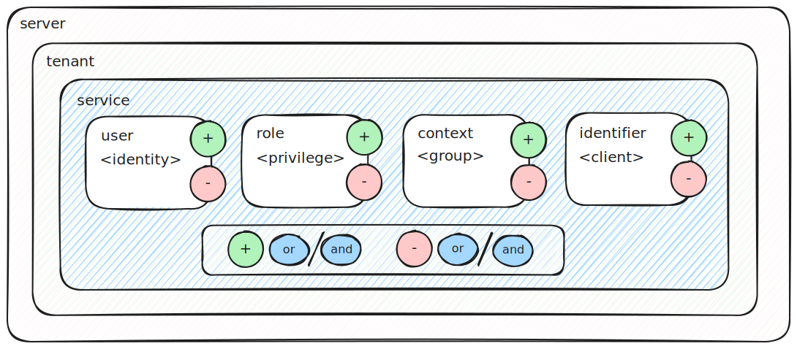

# WebSocket Adapter for CDS

[](https://www.npmjs.com/package/@cap-js-community/websocket)
[](https://www.npmjs.com/package/@cap-js-community/websocket)
[](https://api.reuse.software/info/github.com/cap-js-community/websocket)
[](https://github.com/cap-js-community/websocket/commits/main)

## About this Project

Exposes a WebSocket protocol via [WebSocket standard](https://developer.mozilla.org/de/docs/Web/API/WebSockets_API)
or [Socket.IO](https://socket.io) for CDS services. Runs in the context of the [SAP Cloud Application Programming Model (CAP)](https://cap.cloud.sap)
using [@sap/cds](https://www.npmjs.com/package/@sap/cds) (CDS Node.js).

## Table of Contents

- [Getting Started](#getting-started)
- [Usage](#usage)
  - [Server](#server)
  - [Client](#client)
- [Options](#options)
- [Documentation](#documentation)
  - [Architecture Overview](#architecture-overview)
  - [Protocol Annotations](#protocol-annotations)
  - [WebSocket Server](#websocket-server)
  - [WebSocket Implementation](#websocket-implementation)
    - [WebSocket Service](#websocket-service)
    - [WebSocket Mixin](#websocket-mixin)
  - [Server Socket](#server-socket)
  - [Service Facade](#service-facade)
  - [Middlewares](#middlewares)
  - [Tenant Isolation](#tenant-isolation)
  - [Authentication & Authorization](#authentication--authorization)
  - [Invocation Context](#invocation-context)
  - [Transactional Safety](#transactional-safety)
    - [CDS Persistent Queue](#cds-persistent-queue)
  - [Client Determination](#client-determination)
    - [Filtering Operators](#filtering-operators)
    - [Event Users](#event-users)
    - [Event Roles](#event-roles)
    - [Event Contexts](#event-contexts)
    - [Event Client Identifiers](#event-client-identifiers)
    - [Event Emit Headers](#event-emit-headers)
    - [Value Aggregation](#value-aggregation)
    - [Format Headers](#format-headers)
    - [Ignore Definitions](#ignore-definitions)
  - [WebSocket Format](#websocket-format)
    - [SAP Push Channel Protocol (PCP)](#sap-push-channel-protocol-pcp)
    - [Cloud Events](#cloud-events)
    - [Custom Format](#custom-format)
    - [Generic Format](#generic-format)
  - [Connect & Disconnect](#connect--disconnect)
  - [Server Client Service](#server-client-service)
  - [Approuter](#approuter)
  - [Operations](#operations)
    - [Operation Results](#operation-results)
    - [Unbound Operations](#unbound-operations)
    - [Special Operations](#special-operations)
    - [Bound Operations](#bound-operations)
    - [CRUD Operations](#crud-operations)
  - [Examples](#examples)
    - [Todo (UI5)](#todo-ui5)
    - [Chat (HTML)](#chat-html)
  - [Unit-Tests](#unit-tests)
  - [Adapters](#adapters)
    - [WS Standard Adapters](#ws-standard-adapters)
    - [Socket.IO Adapters](#socketio-adapters)
  - [Deployment](#deployment)
- [Support, Feedback, Contributing](#support-feedback-contributing)
- [Code of Conduct](#code-of-conduct)
- [Licensing](#licensing)

## Getting Started

- Run `npm add @cap-js-community/websocket` in `@sap/cds` project
- Add a WebSocket-enabled CDS service:
  ```cds
  @ws
  service ChatService {
    event received {
      text: String;
    }
  }
  ```
- Emit event from business logic:
  ```js
  await srv.emit("received", { text: "Hello World!" });
  ```
- Start server via `cds-serve`
- Access the service endpoint via the WebSocket client

## Usage

### Server

- Run `npm add @cap-js-community/websocket` in `@sap/cds` project
- Create a service to be exposed as websocket protocol: **srv/chat-service.cds**
  ```cds
  @protocol: 'websocket'
  service ChatService {
    function message(text: String) returns String;
    event received {
      text: String;
    }
  }
  ```
- Implement CDS websocket service: **srv/chat-service.js**
  ```js
  module.exports = (srv) => {
    srv.on("message", async (req) => {
      await srv.emit("received", req.data);
      return req.data.text;
    });
  };
  ```

### Client

In browser environment implement the websocket client: **index.html**

#### WebSocket Standard (`kind: ws`)

- Connect with WebSocket
  ```js
  const protocol = window.location.protocol === "https:" ? "wss://" : "ws://";
  const socket = new WebSocket(protocol + window.location.host + "/ws/chat");
  ```
- Emit event
  ```js
  socket.send(
    JSON.stringify({
      event: "message",
      data: { text: input.value },
    }),
  );
  ```
- Listen to event
  ```js
  socket.addEventListener("message", (message) => {
    const payload = JSON.parse(message.data);
    switch (payload.event) {
      case "received":
        console.log(payload.data.text);
        break;
    }
  });
  ```

#### Socket.IO (`kind: socket.io`)

- Connect with the Socket.IO client
  ```js
  const socket = io("/ws/chat");
  ```
- Emit event
  ```js
  socket.emit("message", { text: "Hello World" });
  ```
- Listen to event
  ```js
  socket.on("received", (message) => {
    console.log(message.text);
  });
  ```

## Options

The CDS websocket modules can be configured with the following options:

- **kind: String**: Websocket implementation kind (`ws`, `socket.io`). Default is `'ws'`.
- **impl: String**: Websocket implementation path. Module provides default for kind.
- **options: Object**: Websocket implementation configuration options. Default is `{}`.
- **adapter: Object**: Websocket adapter configuration options. Default is `{}`.
- **adapter.impl: String**: Websocket adapter implementation (`redis`, `@socket.io/redis-adapter`, `@socket.io/redis-streams-adapter`). Default is `''`.
- **adapter.options: Object**: Websocket adapter implementation options. Default is `{}`.
- **adapter.options.key: String**: Websocket adapter channel prefix. Default is `websocket`.
- **adapter.config: Object**: Websocket adapter implementation configurations (i.e. Redis client options). Default is `{}`.
- **adapter.active: Boolean**: Enable websocket adapter. Default is `true`.
- **adapter.local: Boolean**: Enable websocket adapter in local environment. Default is `false`.

> All CDS Websocket options can also be specified as part of CDS project-specific configuration
> under section `cds.websocket` and accessed during runtime via `cds.env.websocket`.

## Documentation

### Architecture Overview


The CDS Websocket module supports the following use-cases:

- Connect multiple websocket clients (browser and non-browser) to CAP server websockets
- Process websockets messages as CDS entity CRUD, action and function calls
- Broadcast CDS events across local server websockets and multi-instance server websockets (via Redis)
- Broadcast CDS events across multiple CAP server applications and application instances (via Redis)
- Tenant-ware emits/broadcasts CDS events from server websockets to websocket clients (browser and non-browser)
- Emit/Broadcast CDS events to a subset of websocket clients leveraging users, event contexts or client identifiers
- Websocket events support different formats (JSON, PCP, CloudEvents or custom format)

### Protocol Annotations

The CDS WebSocket module supports the following protocol definitions options in CDS:

- `@ws`
- `@websocket`
- `@protocol: 'ws'`
- `@protocol: 'websocket'`
- `@protocol: [{ kind: 'ws', path: 'chat' }]`
- `@protocol: [{ kind: 'websocket', path: 'chat' }]`

If a protocol path is not specified (e.g., via `@path`), it is determined from service name.

If the specified path is relative (i.e., does not start with a slash `/`), it is appended to the default protocol path e.g. `/ws`.
If the path is absolute (i.e., starts with a slash `/`), it is used as is.

Examples:

- `@path: 'chat`: Service is exposed at `/ws/chat`
- `@path: '/chat`: Service is exposed at `/chat`

### WebSocket Server

The CDS websocket server is exposed on `cds` object implementation-independent at `cds.ws` and implementation-specific
at
`cds.wss` for WebSocket Standard or `cds.io` for Socket.IO. Additional listeners can be registered bypassing CDS
definitions and runtime.
WebSocket server options can be provided via `cds.websocket.options`.

Default protocol path is `/ws` and can be overwritten via `cds.env.protocols.websocket.path` resp.
`cds.env.protocols.ws.path`;

### WebSocket Implementation

The CDS websocket server supports the following two websocket implementations:

- [WebSocket Standard](https://developer.mozilla.org/en-US/docs/Web/API/WebSockets_API) (via
  Node.js [ws](https://www.npmjs.com/package/ws) package): `cds.websocket.kind: "ws"` **(default)**
- [Socket.IO](https://socket.io): `cds.websocket.kind: "socket.io"`
- **Custom Server**: A custom websocket server implementation can be provided via a path relative to the project root
  with the configuration `cds.websocket.impl` (e.g. `cds.websocket.impl: './server/xyz.js'`).

The server implementation abstracts from the concrete websocket implementation. The websocket client still needs to be
implemented websocket-implementation-specific.

#### WebSocket Service

Annotated services with websocket protocol are exposed at endpoint: `/ws/<service-path>`:

Websocket client connection happens as follows for exposed endpoints:

- **WS**: `const socket = new WebSocket("ws://localhost:4004/ws/chat");`
- **Socket.IO**: `const socket = io("ws/chat")`

#### WebSocket Mixin

Non-websocket services can contain events and operations that are exposed or accessible as websocket events
via the concept of mixin websocket services. Mixin event and operations need to be annotated with `@websocket` or `@ws`.

**Hint:**

> Non-websocket service events and operations are only active when at least one websocket-enabled service is available
> (i.e., websocket protocol adapter is active).

##### Event Mixin

Websocket services can contain events that are exposed as websocket events. Emitting an event on the service,
broadcasts the event to all websocket clients.

```cds
  @protocol: 'ws'
  @path: 'chat'
  service ChatService {
    event received {
      text: String;
    }
  }
```

In addition, also non-websocket services can contain events that are exposed as websocket events:

```cds
  @protocol: 'odata'
  @path: 'chat'
  service ChatService {
    entity Chat as projection on chat.Chat;
    function message(text: String) returns String;
    @websocket
    event received {
      text: String;
    }
  }
```

Although the service is exposed as an OData protocol at `/odata/v4/chat`, the service events annotated with `@websocket`
or `@ws` are exposed as websocket events under the websocket protocol path as follows:

`/ws/chat` (as derived from `/odata/v4/chat`).

Entities are not exposed, as the service itself is not marked as websocket protocol.

The service path can be overruled on service or event level via `@websocket.path` or `@ws.path` annotation as follows:

```cds
@ws
@ws.path: 'fns-websocket'
@ws.format: 'pcp'
event notify {
    text : String
};
```

The specified event path must match the service path of another websocket-enabled CDS service, otherwise the event is
not processed. In addition, the websocket format can be specified on service or event level via `@websocket.format` or `@ws.format`
annotation for websocket events of non-websocket services.

##### Operation Mixin

Websocket services can contain (unbound) operations (action, function) that are accessible via websocket events.
Calling an operation via websocket event triggers the respective service operation.

```cds
  @protocol: 'ws'
  @path: 'chat'
  service ChatService {
    action sendMessage(text: String);
  }
```

In addition, also non-websocket services can contain (unbound) operations that are accessible via websocket events:

```cds
  @protocol: 'odata'
  @path: 'chat'
  service ChatService {
    entity Chat as projection on chat.Chat;

    @ws
    action sendMessage(text: String);
  }
```

Although the service is exposed as an OData protocol at `/odata/v4/chat`, the service operations annotated with `@websocket`
or `@ws` are accessible via websocket event under the websocket protocol path as follows:

`/ws/chat` (as derived from `/odata/v4/chat`).

Entities (including their bound operations) are not exposed, as the service itself is not marked as websocket protocol.
The service path can be overruled on service or operation level via `@websocket.path` or `@ws.path` annotation as follows:

```cds
@ws
@ws.path: 'fns-websocket'
action chat(text: String);
```

The specified operation path must match the service path of another websocket-enabled CDS service, otherwise the operation is
not processed. In addition, the websocket format can be specified on service or operation level via `@websocket.format` or `@ws.format`
annotation for websocket operations of non-websocket services.

### Server Socket

Each CDS handler request context is extended to hold the current server `socket` instance of the event.
It can be accessed via the service websocket facade via `req.context.ws.service` or `cds.context.ws.service`.
In addition, the native websocket server socket can be accessed via `req.context.ws.socket` or `cds.context.ws.socket`.
Events can be directly emitted via the native `socket`, bypassing CDS runtime, if necessary.

### Service Facade

The service facade provides native access to websocket implementation independent of CDS context
and is accessible on socket via `socket.facade` or in CDS context via `req.context.ws.service`.
It abstracts from the concrete websocket implementation by exposing the following public interface:

- `service: Object`: Service definition
- `path: String`: Service path
- `socket: Object`: Server socket
- `context: Object`: CDS context object for the websocket server socket
- `on(event: String, callback: Function)`: Register websocket event
- `async emit(event: String, data: Object, headers: Object)`: Emit websocket event with data and headers
- `async broadcast(event: String, data: Object, headers: Object?, filter: { user: {include: String[], exclude: String[]}?, role: {include: String[], exclude: String[]}?, context: {include: String[], exclude: String[]}?, identifier: {include: String[], exclude: String[]}? }?)`:
  Broadcast websocket event (except to sender) by optionally restrict to users, contexts or identifiers and optionally providing headers
- `async broadcastAll(event: String, data: Object, headers: Object?, filter: { user: {include: String[], exclude: String[]}?, role: {include: String[], exclude: String[]}?, context: {include: String[], exclude: String[]}?, identifier: {include: String[], exclude: String[]}? }?)`:
  Broadcast websocket event (including to sender) by optionally restrict to users, contexts or identifiers and optionally providing headers
- `async enter(context: String)`: Enter a context
- `async exit(context: String)`: Exit a context
- `async disconnect()`: Disconnect server socket
- `onDisconnect(callback: Function)`: Register callback function called on disconnect of server socket

### Middlewares

For each server websocket connection the standard CDS middlewares are applied. That means that especially the correct
CDS context is set up and the configured authorization strategy is applied.

### Tenant Isolation

WebSockets are processed tenant aware. Especially for broadcasting events, tenant isolation is ensured that only
websocket clients connected to the same tenant are notified in the tenant context. Tenant isolation is also ensured
over remote distribution via Redis.

### Authentication & Authorization

Authentication works best via [AppRouter](https://www.npmjs.com/package/@sap/approuter) (e.g., using a UAA configuration),
as the auth token is forwarded via authorization header bearer token by AppRouter to backend websocket call.

CDS auth strategy (e.g. `cds.requires.auth.kind: 'xsuaa'`) is applied and CDS auth middleware processes the auth token and
set the auth info accordingly. Authorization scopes are checked as defined in the CDS services `@requires` annotations
and authorization restrictions are checked as defined in the CDS services `@restrict` annotations.

Authentication can also be performed without AppRouter as long as the WebSocket Upgrade request contains
a valid authorization header in accordance to the CDS auth strategy defined in CDS env:

Example for xsuaa based CDS auth strategy:

```json
{
  "cds": {
    "requires": {
      "auth": {
        "kind": "xsuaa"
      }
    }
  }
}
```

Headers of Websocket Upgrade request can be accessed via `req.http.req.headers` in websocket service handlers.

### Invocation Context

In the context of a WebSocket enabled CDS service, WebSockets events can be directly emitted to the service in the event
handler:

```js
srv.on("action", async (req) => {
  await srv.emit("message", req.data);
});
```

In case, the context of invocation is not a WebSocket service, e.g., call is coming from OData or Rest request,
still the WebService events can be published by connecting to the WebSocket enabled service as follows:

```js
const wsService = await cds.connect.to("WSService");
await wsService.tx(req).emit("message", req.data);
```

`cds.conntect.to` can be used to connect to any WebSocket enabled service, to emit events to the WebSocket service.
Use `tx(req)` before `emit` in order to propagate the current context to the WebSocket enabled service,
to especially ensure tenant and user propagation for broadcasting.

### Transactional Safety

In most situations only websocket events shall be broadcast, in case the primary transaction succeeded.
It can be done manually, by emitting CDS event as part of the `req.on("succeeded")` handler.

```js
req.on("succeeded", async () => {
  await srv.emit("received", req.data);
});
```

Alternatively you can leverage the CAP in-memory queue via `cds.queued` as follows:

```js
const chatService = cds.queued(await cds.connect.to("ChatService"));
await chatService.tx(req).emit("received", req.data);
```

This has the benefit that the event emitting is coupled with the success of the primary transaction.
Still, the asynchronous event processing could fail and would not be retried anymore.
That's where the CDS persistent queue comes into play.

#### CDS Persistent Queue

Websocket events can also be sent via the CDS persistent queue. That means the CDS events triggering the websocket
broadcast
are added to the CDS persistent queue when the primary transaction succeeded. The events are processed asynchronously
and transactional safe in a separate transaction. It is ensured that the event is processed in any case, as queue
keeps the queue entry open until the event processing succeeds.

The transactional safety can be achieved using `cds.queued` with kind `persistent-queue` as follows:

```js
const chatService = cds.queued(await cds.connect.to("ChatService"), {
  kind: "persistent-queue",
});
await chatService.tx(req).emit("received", req.data);
```

In that case, the websocket event is broadcast to websocket clients exactly once, when the primary transaction succeeds.
In case of execution errors, the event broadcast is retried automatically, while processing the persistent queue.

Websocket services with `queued` or `outboxed` configuration in respective `cds.requires` section are automatically
queued/outboxed.

### Client Determination

The client determination during WebSocket event broadcasting/emitting is based on the following filtering layers of the event:

- **Tenant**: Only websocket clients connected to the same event tenant are notified.
- **Service**: Only websocket clients connected to the same event service are notified.
- **User**: Only websocket clients connected to the current or defined event users are notified.
- **Role**: Only websocket clients connected to the users with specific roles are notified.
- **Context**: Only websocket clients in the part of the defined event contexts are notified.
- **Client Identifier**: Only websocket clients with the defined event client identifier are notified.

Tenant and service are determined automatically based on the CDS context and are applied per default to ensure tenant
and service isolation. User, role, context and client identifiers are optional and are determined based on the event data or event emit headers.
They can be combined arbitrarily to filter the websocket clients to be notified.

The client filtering options are depicted in the following diagram:



The diagram shows the mandatory filtering layer `tenant` and `service` and the optional filtering layers `user`, `role`
`context` and `client identifier`. The `+` and `-` symbols on the optional filter layers indicating the possibility to
include (`+`) or exclude (`-`) filtering conditions as described in the upcoming sections:

- `+`: Include filtering condition. Inclusion is additive by default.
- `-`: Exclude filtering condition. Exclusion is subtractive and has precedence over inclusion.
- `or`: Include/Exclude filtering layers are combined via `or` operator by default.
- `and`: Include/Exclude filtering layers can be combined via `and` operator.

#### Filtering Operators

The default filtering operator is additive (`or` operator). This means, if multiple filtering layers are defined
the filtering conditions are combined via `or` operator. Filtering values within the same layer are always combined with`or` operator.
Include filters and exclude filters are always combined via `and not` operator.

**Example:**

```
(userA or contextA) and !(roleA or contextB)
```

The filtering operators can be changed to be restrictive (`and` operator) with regard to filtering layers via the following options:

**Include Filters:**

- Project config via env `cds.websocket.operator.include: 'and'`
- Service level via annotation `@websocket.operator.include: 'and'` or `@ws.operator.include: 'and'`
- Event level via annotation `@websocket.operator.include: 'and'` or `@ws.operator.include: 'and'`
- Header level via emit header `operatorInclude: 'and'` or `includeOperator: 'and'`

**Exclude Filters:**

- Project config via env `cds.websocket.operator.exclude: 'and'`
- Service level via annotation `@websocket.operator.exclude: 'and'` or `@ws.operator.exclude: 'and'`
- Event level via annotation `@websocket.operator.exclude: 'and'` or `@ws.operator.exclude: 'and'`
- Header level via emit header `operatorExclude: 'and'` or `excludeOperator: 'and'`

**Example:**

```
(userA and contextA) and !(roleA and contextB)
```

#### Event Users

##### Current User

Events are broadcast to all websocket clients, including clients established in the context of the current context user.
To influence event broadcasting based on current context user, the annotation `@websocket.user` or `@ws.user` is
available on event level and event element level (alternatives include `@websocket.broadcast.user` or `@ws.broadcast.user`):

Valid annotation values are:

- **Event level**:
  - `'includeCurrent'`: Current context user is statically included during broadcasting to websocket clients.
    Only websocket clients established in the context of that user are respected during event broadcast.
  - `'excludeCurrent'`: Current context user is statically excluded during broadcasting to websocket clients.
    All websocket clients established in context to that user are not respected during event broadcast.
- **Event element level**:
  - `'includeCurrent'`: Current context user is dynamically included during broadcasting to websocket clients,
    based on the value of the annotated event element. If truthy, only websocket clients established in the context of
    that user are respected during event broadcast.
  - `'excludeCurrent'`: Current context user is dynamically excluded during broadcasting to websocket clients,
    based on the value of the annotated event element. If truthy, all websocket clients established in the context of that
    user are not respected during event broadcast.

Furthermore, also additional equivalent annotations alternatives are available:

- Include current user:
  - `@websocket.currentUser.include: Boolean` (shorthand: `@websocket.currentUser: Boolean`)
  - `@ws.currentUser.include: Boolean` (shorthand: `@ws.currentUser: Boolean`)
  - `@websocket.broadcast.currentUser.include: Boolean` (shorthand: `@websocket.broadcast.currentUser: Boolean`)
  - `@ws.broadcast.currentUser.include: Boolean` (shorthand: `@ws.broadcast.currentUser: Boolean`)

- Exclude current user:
  - `@websocket.currentUser.exclude: Boolean`
  - `@ws.currentUser.exclude: Boolean`
  - `@websocket.broadcast.currentUser.exclude: Boolean`
  - `@ws.broadcast.currentUser.exclude: Boolean`

**Examples:**

**Event Level:**

```cds
@websocket.user: 'includeCurrent'
event received {
  name: String;
  text: String;
}
```

Event is published only to websocket clients established in context to the current context user.

**Event Element Level:**

```cds
event received {
  name: String;
  text: String;
  @websocket.currentUser.exclude
  flag: Boolean
}
```

Event is published only to websocket clients not established in context to the current context user, if the event data of
`flag` is truthy.

#### Defined Users

Events are broadcast to all websocket clients. To influence event broadcasting based on defined users,
the following annotations to include or exclude defined users are available:

- Include user(s):
  - `@websocket.user.include` (shorthand: `@websocket.user`)
  - `@ws.user.include` (shorthand: `@ws.user`)
  - `@websocket.broadcast.user.include` (shorthand: `@websocket.broadcast.user`)
  - `@ws.broadcast.user.include` (shorthand: `@ws.broadcast.user`)

- Exclude user(s):
  - `@websocket.user.exclude`
  - `@ws.user.exclude`
  - `@websocket.broadcast.user.exclude`
  - `@ws.broadcast.user.exclude`

Valid annotation values are:

- **Event level**:
  - Type: `String[] | String`
  - Provide static unique users to include or exclude from event broadcasting
  - Value can be a single user or an array of users
- **Event element level**:
  - Type: `Boolean`
  - Value from event data for the annotated element is used as users to include to or exclude from event broadcasting
  - Value can be a single user or an array of users

**Examples:**

**Event Level:**

```cds
@websocket.user.exclude: 'ABC'
event received {
  name: String;
  text: String;
}
```

Event is published to all users except the user `ABC`.

**Event Element Level:**

```cds
event received {
  name: String;
  text: String;
  @websocket.user.include
  users: many String;
}
```

Event is only published to all users listed in the event data of `users`.

#### Event Roles

Events are broadcast to all websocket clients. To influence event broadcasting based on user roles,
the roles to be considered for event broadcasting can be defined via service annotation `@requires`
or in addition via CDS env configuration `cds.websocket.roles`:

```json
{
  "cds": {
    "websocket": {
      "roles": ["admin"]
    }
  }
}
```

The following annotations to include or exclude users based on their roles are available:

- Include user(s) with roles:
  - `@websocket.role.include` (shorthand: `@websocket.role`)
  - `@ws.role.include` (shorthand: `@ws.role`)
  - `@websocket.broadcast.role.include` (shorthand: `@websocket.broadcast.role`)
  - `@ws.broadcast.role.include` (shorthand: `@ws.broadcast.role`)

- Exclude user(s) with roles:
  - `@websocket.role.exclude`
  - `@ws.role.exclude`
  - `@websocket.broadcast.role.exclude`
  - `@ws.broadcast.role.exclude`

Valid annotation values are:

- **Event level**:
  - Type: `String[] | String`
  - Provide static unique user roles to include or exclude from event broadcasting
  - Value can be a single user role or an array of user roles
- **Event element level**:
  - Type: `Boolean`
  - Value from event data for the annotated element is used as user roles to include to or exclude from event broadcasting
  - Value can be a single user role or an array of users roles

**Examples:**

**Event Level:**

```cds
@websocket.role.exclude: 'ABC'
event received {
  name: String;
  text: String;
}
```

Event is published to all users except the user having role `ABC`.

**Event Element Level:**

```cds
event received {
  name: String;
  text: String;
  @websocket.role.include
  roles: many String;
}
```

Event is only published to all user having roles listed in the event data of `roles`.

#### Event Contexts

It is possible to broadcast events to a subset of clients. By entering or exiting contexts, the server can be instructed
to determine to which subset of clients the event shall be emitted, based on the event. To specify which data parts of the
event are leveraged for setting up the context, the annotation `@websocket.context` or `@ws.context` is available on
event element level (alternatives include `@websocket.broadcast.context` or `@ws.broadcast.context`). For static
contexts
the annotation can also be used on the event level, providing a static event context string.

To influence event broadcasting based on event contexts, the following annotations to include or exclude contexts are
available:

- Include context(s):
  - `@websocket.context.include` (shorthand: `@websocket.context`)
  - `@ws.context.include` (shorthand: `@ws.context`)
  - `@websocket.broadcast.context.include` (shorthand: `@websocket.broadcast.context`)
  - `@ws.broadcast.context.include` (shorthand: `@ws.broadcast.context`)

- Exclude context(s):
  - `@websocket.context.exclude: String[] | String`
  - `@ws.context.exclude: String[] | String`
  - `@websocket.broadcast.context.exclude: String[] | String`
  - `@ws.broadcast.context.exclude: String[] | String`

Valid annotation values are:

- **Event level**:
  - Type: `String[] | String`
  - Provide static contexts to include or exclude from event broadcasting
  - Value can be a single context or an array of contexts
- **Event element level**:
  - Type: `Boolean`
  - Value from event data for the annotated element is used as context to include to or exclude from event
    broadcasting
  - Value can be a single context or an array of contexts

**Examples:**

**Event Level:**

```cds
@websocket.context: 'ABC'
event received {
  ID: UUID;
  text: String;
}
```

Event is only published to all clients in context `ABC`.

**Event Element Level:**

```cds
event received {
  @websocket.context
  ID: UUID;
  text: String;
}
```

Event is only published to all clients in context of the event data of `ID`.

The annotation can be used on multiple event elements setting up different event contexts in parallel
if the event shall be broadcast/emitted into multiple contexts at the same time.

```cds
event received {
  @websocket.context
  ID: UUID;
  @websocket.context
  name: String;
  text: String;
}
```

Event contexts can also be established via event elements of `many` or `array of` type:

```cds
event received {
  @websocket.context
  ID: many UUID;
  text: String;
}
```

This allows setting up an unspecified number of different event contexts in parallel during runtime.

Event contexts support all CDS/JS types. The serialization is performed as follows:

- `Date`: `context.toISOString()`
- `Object`: `JSON.stringify(context)`
- other: `String(context)`

To manage event contexts, the following options exist:

- **Server side**: Call websocket service facade
  - CDS context object `req` exposes the websocket facade via `req.context.ws.service` providing the following context
    functions
    - **Enter Context**: `enter(context: String)` - Enter the current server socket into the passed context
    - **Exit Context**: `exit(context: String)` - Exit the current server socket from the passed context
    - **Reset Contexts**: `reset()` - Resets all contexts
- **Client side**: Emit `wsContext` event from client socket.
  - **Enter Context**:
    - WS Standard:
      ```js
      socket.send(JSON.stringify({ event: "wsContext", data: { context: "..." } }));
      ```
    - Socket.IO:
      ```js
      socket.emit("wsContext", { context: "..." });
      ```
  - **Exit**:
    - WS Standard:
      ```js
      socket.send(JSON.stringify({ event: "wsContext", data: { context: "...", exit: true } }));
      ```
    - Socket.IO:
      ```js
      socket.emit("wsContext", { context: "...", exit: true });
      ```
  - **Reset**:
    - WS Standard:
      ```js
      socket.send(JSON.stringify({ event: "wsContext", data: { reset: true } }));
      ```
    - Socket.IO:
      ```js
      socket.emit("wsContext", { reset: true });
      ```

Single context can be entered/exited via `context: String` parameter. Multiple contexts can be entered/excited
for the same server socket at the same time via `contexts: String[]` parameter.
Parameter `reset: Boolean` can be used to reset all entered contexts for a server socket.
Reset and enter context can be used within a single `wsContext` call.
First, all contexts are reset and then the new contexts are entered.

Furthermore, a service operation named `wsContext` is invoked, if existing on the websocket enabled CDS service:

```cds
action wsContext(context: String, contexts: array of String, exit: Boolean, reset: Boolean);
```

Event context isolation is also ensured over remote distribution via Redis.

For Socket.IO (`kind: socket.io`) contexts are implemented leveraging [Socket.IO rooms](https://socket.io/docs/v4/rooms/).

#### Event Client Identifiers

Events are broadcast to all websocket clients, including clients that performed certain actions. When events are sent
as part of the websocket context, access to the current socket is given, but if actions are performed outside the websocket context,
there are no means to identify the client that performed the action.

That's where the event client identifier comes into play. Client identifier is unique consumer-provided strings that
are provided during the websocket connection to identify the websocket client as well as in other request cases (e.g.,
OData call).
When an OData call with a client identifier is performed, it can be used to restrict the websocket event broadcasting.

In some cases, the websocket clients shall be restricted on an instance basis. There are use-cases that only certain
clients are informed about an event and also in other cases the client shall not be informed about the event that was
triggered by the same client (maybe via a different channel, e.g., OData).
Therefore, websocket clients can be identified optionally by a unique identifier provided as URL parameter option
`?id=<globally unique value>`.

The annotation `@websocket.identifier.include` or `@ws.identifier.include` is available on event level and event element
level to influence event-broadcasting-based websocket client identifier to include certain clients based on their
identifier (not listed clients are no longer respected when set)
(alternatives include `@websocket.broadcast.identifier.include` or `@ws.broadcast.identifier.include`):

The annotation `@websocket.identifier.exclude` or `@ws.identifier.exclude` is available on event level and event element
level to influence event-broadcasting-based websocket client identifier to exclude certain clients based on their
identifier (alternatives include `@websocket.broadcast.identifier.exclude` or `@ws.broadcast.identifier.exclude`):

The full list of annotations is:

- Include client identifier(s):
  - `@websocket.identifier.include` (shorthand: `@websocket.identifier`)
  - `@ws.identifier.include` (shorthand: `@ws.identifier`)
  - `@websocket.broadcast.identifier.include` (shorthand: `@websocket.broadcast.identifier`)
  - `@ws.broadcast.identifier.include` (shorthand: `@ws.broadcast.identifier`)

- Exclude client identifiers(s):
  - `@websocket.identifier.exclude: String[] | String`
  - `@ws.identifier.exclude: String[] | String`
  - `@websocket.broadcast.identifier.exclude: String[] | String`
  - `@ws.broadcast.identifier.exclude: String[] | String`

Valid annotation values are:

- **Event level**:
  - Type: `String[] | String`
  - Provide static unique identifiers to include or exclude clients from event broadcasting
  - Value can be a single identifier string or an array of identifier strings
- **Event element level**:
  - Type: `Boolean`
  - Value from event data for the annotated element is used as unique identifiers to include or exclude websocket
    clients from event broadcasting
  - Value can be a single identifier string or an array of identifier strings

**Examples:**

**Event Level:**

```cds
@websocket.identifier.include: 'ABC'
event received {
  ID: UUID;
  text: String;
}
```

Event is only published to all clients with identifier `ABC`.

**Event Element Level:**

```cds
event received {
  ID: UUID;
  @websocket.identifier.include
  ids: many String;
}
```

Event is only published to all clients with identifiers listed in the event data of `ids`.

##### Identifier Setup

###### Client Side

The unique identifier can be provided for a websocket client as follows:

- WS Standard:
  ```js
  socket = new WebSocket("ws://localhost:4004/ws/chat?id=1234");
  ```
- Socket.IO:
  ```js
  const socket = io("/ws/chat?id=1234");
  ```

###### Server Side

The unique identifier can be provided for a websocket client server connection on server side via `req.id = '1234'`
for the WebSocket Upgrade request (`req`). Custom CDS middleware can be registered via `cds.middlewares.add`
to set the request unique client identifier as part of the WebSocket Upgrade request.

Be aware that CDS middlewares are running for any CDS request. Restriction to WebSocket upgrade requests only
can be done as follows:

```js
if (req.upgrade) {
  req.id = "1234";
}
```

#### Event Emit Headers

The websocket implementation allows providing event emit headers to dynamically control websocket processing.
The following headers are available:

- Include the current user in the event publication (see section Event Users → Current User):
  - `wsCurrentUser: Boolean` (shorthand)
  - `wsCurrentUser.include: Boolean`
  - `wsCurrentUserInclude: Boolean`
  - `currentUser: Boolean` (shorthand)
  - `currentUser.include: Boolean`
  - `currentUserInclude: Boolean`
- Exclude current user from event publication (see section Event Users -> Current User)
  - `wsCurrentUser.exclude: Boolean`
  - `wsCurrentUserExclude: Boolean`
  - `currentUser.exclude: Boolean`
  - `currentUserExclude: Boolean`
- Include one or many users in an event publication (see section Event Users → Defined Users):
  - `wsUsers: String[] | String` (shorthand)
  - `wsUser: String[] | String` (shorthand)
  - `wsUser.include: String[] | String`
  - `wsUserInclude: String[] | String`
  - `users: String[] | String` (shorthand)
  - `user: String[] | String` (shorthand)
  - `user.include: String[] | String`
  - `userInclude: String[] | String`
- Exclude one or many users from the event publication (see section Event Users → Defined Users)
  - `wsUser.exclude: String[] | String`
  - `wsUserExclude: String[] | String`
  - `user.exclude: String[] | String`
  - `userExclude: String[] | String`
- Include one or many user roles in an event publication (see section Event Users → Defined Roles):
  - `wsRoles: String[] | String` (shorthand)
  - `wsRole: String[] | String` (shorthand)
  - `wsRole.include: String[] | String`
  - `wsRoleInclude: String[] | String`
  - `roles: String[] | String` (shorthand)
  - `role: String[] | String` (shorthand)
  - `role.include: String[] | String`
  - `roleInclude: String[] | String`
- Exclude one or many user roles from the event publication (see section Event Users → Defined Roles)
  - `wsRole.exclude: String[] | String`
  - `wsRoleExclude: String[] | String`
  - `role.exclude: String[] | String`
  - `roleExclude: String[] | String`
- Include one or many contexts in an event publication (see section Event Contexts)
  - `wsContext: String[] | String` (shorthand)
  - `wsContexts: String[] | String` (shorthand)
  - `wsContext.include: String[] | String`
  - `wsContextInclude: String[] | String`
  - `context: String[] | String` (shorthand)
  - `contexts: String[] | String` (shorthand)
  - `context.include: String[] | String`
  - `contextInclude: String[] | String`
- Exclude one or many contexts from the event publication (see section Event Contexts)
  - `wsContext.exclude: String[] | String`
  - `wsContextExclude: String[] | String`
  - `context.exclude: String[] | String`
  - `contextExclude: String[] | String`
- Include one or many client identifiers in an event publication (see section Event Client Identifier)
  - `wsIdentifier: String[] | String` (shorthand)
  - `wsIdentifiers: String[] | String` (shorthand)
  - `wsIdentifier.include: String[] | String`
  - `wsIdentifierInclude: String[] | String`
  - `identifier: String[] | String` (shorthand)
  - `identifiers: String[] | String` (shorthand)
  - `identifier.include: String[] | String`
  - `identifierInclude: String[] | String`
- Exclude one or many client identifiers from event publication (see section Event Client Identifier)
  - `wsIdentifier.exclude: String[] | String`
  - `wsIdentifierExclude: String[] | String`
  - `identifier.exclude: String[] | String`
  - `identifierExclude: String[] | String`

Emitting events with headers can be performed as follows:

```js
await srv.emit("customEvent", { ... }, {
  contexts: ["..."],
  currentUser: {
    exclude: req.data.type === "1"
  },
  user: {
    include: "...",
    exclude: ["..."],
  },
  roles: ["..."],
  identifier: {
    include: ["..."],
    exclude: "...",
  },
});
```

##### Event HTTP Headers

In addition to the above event emit headers, HTTP conform headers can be specified starting with `x-websocket-` or `x-ws-`  
prefix. The lower case header names are converted to camel-cased header names removing prefix, e.g. `x-ws-current-user` becomes `currentUser`.
Header string values are parsed according to their value to types `Boolean`, `Number` or `String`.

Format-specific HTTP conform headers can be defined in formatter named subsection, `x-websocket-<format>-` or `x-ws-<format>-`.

**Examples** (for format `cloudevent`):

- `x-ws-cloudevent-subject: 'xyz'` becomes nested JSON header object `{ "cloudevent": { subject: "xyz" } }` in `cloudvent` formatter.
- `x-ws-cloudevent-value: '1'` becomes nested JSON header object `{ "cloudevent": { value: 1 } }` in `cloudvent` formatter.

#### Value Aggregation

The respective event annotations (described in the sections above) are respected in addition to event emit header
specification. All event annotation values (static or dynamic) and header values are aggregated during event
emitted according to their kind. Values of all headers and annotations of the same semantic type are unified for
single and array values.

#### Format Headers

In addition to the above event emit headers, format-specific event headers can be specified in the `websocket` or `ws` section
during event emitted.

```js
await srv.emit("customEvent", { ... }, {
  ws: {
    a: 1,
    cloudevent: {
      e: true
    }
  },
  websocket: {
    b: "c"
  }
});
```

These headers are made available to the format `compose(event, data, headers)` function, to be included in the
composed WebSocket message, if applicable (e.g., format: `pcp`, `cloudevent`). Format-specific headers can also be defined
in formatter named subsection, e.g. `ws.cloudevent.e: true` (for format `cloudevent`), to avoid conflicts.

#### Ignore Definitions

To ignore elements and parameters during event processing, the annotation `@websocket.ignore` or `@ws.ignore` is available
on event element and operation parameter level. The annotation can be used to exclude elements and parameters from the WebSocket event.

### WebSocket Format

Per default the CDS websocket format is `json`, as CDS internally works with JSON objects.

WS Standard and Socket.IO support JSON format as follows:

- **WS Standard**: Message is serialized to a JSON object with format `{ event, data }`
- **Socket.IO**: Events and JSON objects are intrinsically supported. No additional serialization is necessary.

#### SAP Push Channel Protocol (PCP)

CDS WebSocket module supports the SAP Push Channel Protocol (PCP) out-of-the-box.

A PCP message has the following structure:

```text
pcp-action:MESSAGE
pcp-body-type:text
field1:value1
field2:value2

this is the body!
```

To configure the PCP format, the service needs to be annotated in addition with `@websocket.format: 'pcp'` or
`@ws.format: 'pcp'`:

```cds
@ws
@ws.format: 'pcp'
service PCPService {
  // ...
}
```

With this configuration WebSocket events consume or produce PCP formatted messages.
To configure the PCP message format, the following annotations are available:

- **Operation level**:
  - `@websocket.pcp.action, @ws.pcp.action: String`: Correlate `pcp-action` in a PCP message to identify the CDS
    operation via annotation. If not defined, the operation name is correlated.
- **Operation parameter level**:
  - `@websocket.pcp.message, @ws.pcp.message: Boolean`: Correlate the PCP message body to the operation parameter
    representing the message.
- **Event level**:
  - `@websocket.pcp.event, @ws.pcp.event: Boolean | String`: Expose the CDS event (Boolean) or the passed value (String) as `pcp-event` field in the PCP message.
  - `@websocket.pcp.message, @ws.pcp.message: String`: Expose a static message text as PCP message body.
  - `@websocket.pcp.action, @ws.pcp.action: String`: Exposes a static action as `pcp-action` field in the PCP message.
    Default `MESSAGE`.
- **Event element level**:
  - `@websocket.pcp.message, @ws.pcp.message: Boolean`: Expose the string value of the annotated event element as PCP
    message body.
  - `@websocket.pcp.action, @ws.pcp.action: Boolean`: Expose the string value of the annotated event element as
    `pcp-action` field in the PCP message. Default `MESSAGE`.

##### Fiori Side Effects

PCP format can be used to emit Fiori side effects via WebSocket events.
To configure Fiori side effects in PCP format enabled service, the following annotations are available:

- **Event level**:
  - `@websocket.pcp.sideEffect, @ws.pcp.sideEffect: Boolean`: Expose Fiori side effects in the PCP message
  - `@websocket.pcp.channel, @ws.pcp.channel: String`: Specify the PCP side effects channel in the PCP message

Example:

```cds
@ws.pcp.sideEffect
@ws.pcp.channel: 'amc\://notification/notify'
event sideEffect {
    sideEffectsSource: String;
}
```

Emitting the event `sideEffect` via CDS emit, as follows:

```js
await srv.emit("sideEffect", {
  sideEffectsSource: "/Header(ID='e0582b6a-6d93-46d9-bd28-98723a285d40')",
});
```

It results in the following PCP message sent via websocket protocol:

```
pcp-action:MESSAGE
pcp-channel:amc:\:notification/notify
sideEffectsSource:/Header(ID='e0582b6a-6d93-46d9-bd28-98723a285d40')
sideEffectsEventName:sideEffect
serverAction:RaiseSideEffect


```

Fiori Elements V4 applications listening on channel will process the side effects, and update the UI accordingly.

##### Manage Contexts

To manage contexts in format `pcp`, `wsContext` event can be emitted in the following way:

- Model `wsContext` CDS service operation as follows:
  ```
  @ws.pcp.action: 'wsContext'
  action wsContext(context: String, exit: Boolean, reset: Boolean);
  ```
- Call `wsContext` message in `pcp` format like this:

  ```
  pcp-action:wsContext
  pcp-body-type:text
  context:context
  exit:false
  reset:true

  wsContext
  ```

The PCP action needs to match an operation with annotation `@websocket.pcp.action` or `@ws.pcp.action`.
Modeled action parameters `context`, `exit` and `reset` are mapped from `pcp` message fields.

#### Cloud Events

CDS WebSocket module supports the [Cloud Events](https://cloudevents.io) specification out-of-the-box, according to
[WebSockets Protocol Binding for CloudEvents](https://github.com/cloudevents/spec/blob/main/cloudevents/bindings/websockets-protocol-binding.md).

A Cloud Event message has the following structure:

```json
{
  "specversion": "1.0",
  "type": "com.example.someevent",
  "source": "/mycontext",
  "subject": null,
  "id": "C234-1234-1234",
  "time": "2018-04-05T17:31:00Z",
  "comexampleextension1": "value",
  "comexampleothervalue": 5,
  "datacontenttype": "application/json",
  "data": {
    "appinfoA": "abc",
    "appinfoB": 123,
    "appinfoC": true
  }
}
```

To configure the CloudEvents format, the service needs to be annotated in addition with `@websocket.format: 'cloudevent'` or
`@ws.format: 'cloudevent'`.

```cds
@ws
@ws.format: 'cloudevent'
service CloudEventService {
  // ...
}
```

To create a Cloud Event compatible CDS event, either the event is modeled as a CDS service event according to the specification
or a CDS event is mapped via annotations to a Cloud Event compatible event.

##### Modeling Cloud Event

Cloud event can be explicitly modeled as a CDS event, matching the specification of cloud event attributes.

**Example:**

```cds
event cloudEvent {
    specversion : String;
    type : String;
    source : String;
    subject : String;
    id : String;
    time : String;
    comexampleextension1 : String;
    comexampleothervalue : String;
    datacontenttype : String;
    data: {
        appinfoA : String;
        appinfoB : Integer;
        appinfoC : Boolean;
    }
}
```

The CDS event `cloudEvent` is explicitly modeled according to the Cloud Event specification.
The event data is passed inbound and outbound in the exact same representation as the JSON object, as specified.
No additional annotations are necessary to be defined.

##### Mapping Cloud Event

CDS events can also be mapped to Cloud Event compatible events via headers and CDS annotations. The implementation is based on the
`generic` formatter (see a section below), that allows to map CDS events to Cloud Event compatible events based on
clouded event-specific headers and wildcard annotations, starting with `@websocket.cloudevent.<annotation>` or `@ws.cloudevent.<annotation>`
to match the Cloud Event specific attributes.

The provided header values in the `websocket` or `ws` section are mapped to the cloud event attributes generically, if available.

**Example:**

```js
await srv.emit(
  "cloudEvent",
  {
    appinfoA,
    appinfoB,
    appinfoC,
  },
  {
    ws: {
      specversion: "1.0",
      type: "com.example.someevent.cloudEvent4",
      source: "/mycontext",
      subject: req.data._subject || "example",
      id: "C234-1234-1234",
      time: "2018-04-05T17:31:00Z",
      comexampleextension1: "value",
      comexampleothervalue: 5,
      datacontenttype: "application/json",
    },
  },
);
```

Subsequently, the following annotations are respected:

- **Event level**:
  - `@websocket.cloudevent.<attribute>: <value>`
  - Type: `any` (according to Cloud Event JSON format)
  - Provide static cloud event attribute value, according to cloud event specification
- **Event element level**:
  - `@websocket.cloudevent.<attribute>`
  - Type: `Boolean`
  - Value from event data for the annotated element is used as a dynamic cloud event attribute value, according to cloud event attribute specification

**Examples:**

**Event Level:**

```cds
@ws.cloudevent.specversion         : '1.0'
@ws.cloudevent.type                : 'com.example.someevent'
@ws.cloudevent.source              : '/mycontext'
@ws.cloudevent.subject             : 'example'
@ws.cloudevent.id                  : 'C234-1234-1234'
@ws.cloudevent.time                : '2018-04-05T17:31:00Z'
@ws.cloudevent.comexampleextension1: 'value'
@ws.cloudevent.comexampleothervalue: 5
@ws.cloudevent.datacontenttype     : 'application/json'
event cloudEvent2 {
    appinfoA : String;
    appinfoB : Integer;
    appinfoC : Boolean;
}
```

Event is published via cloud event sub-protocol, with the specified static cloud event attributes.
The CDS event data is consumed as a cloud event data section.

**Event Element Level:**

```cds
event cloudEvent3 {
    @ws.cloudevent.specversion
    specversion     : String
    @ws.cloudevent.type
    type            : String
    @ws.cloudevent.source
    source          : String
    @ws.cloudevent.subject
    subject         : String
    @ws.cloudevent.id
    id              : String
    @ws.cloudevent.time
    time            : String
    @ws.cloudevent.comexampleextension1
    extension1      : String
    @ws.cloudevent.comexampleothervalue
    othervalue      : String
    @ws.cloudevent.datacontenttype
    datacontenttype : String;
    appinfoA        : String;
    appinfoB        : Integer;
    appinfoC        : Boolean;
}
```

Event is published via cloud event sub-protocol, with the specified dynamic cloud event attributes derived from
CDS event elements. Annotated elements are consumed as cloud event attributes, non-annotated elements are consumed as
a cloud event data section.

Static and dynamic annotations can be combined. Static values have precedence over dynamic values, if defined.

##### Cloud Event Operation

CDS service operations (actions or functions) can also be exposed via cloud event. The operation name is derived from the `@websocket.cloudevent.name` or
`@ws.cloudevent.name` annotation. Emitting a cloud-event-based websocket event that matches the annotation value of `name`, calls the
respective service operation handler.

The operation parameter structure can be either modeled according to the Cloud Event specification using the attributes as parameter names or
mapped via annotations like `@websocket.cloudevent.<annotation>` or `@ws.cloudevent.<annotation>` to a Cloud Event compatible structure.

The following annotations are respected:

- **Operation level**:
  - `@websocket.cloudevent.<attribute>: <value>`
  - Type: `any` (according to Cloud Event JSON format)
  - Provide static cloud event attribute value, according to cloud event specification
- **Operation parameter level**:
  - `@websocket.cloudevent.<attribute>`
  - Type: `Boolean`
  - Value from the operation parameter for the annotated element is used as a dynamic cloud event attribute value, according to cloud event attribute specification

**Examples:**

**Model Operation Parameters:**

```cds
type CloudEventDataType : {
    appinfoA : String;
    appinfoB : Integer;
    appinfoC : Boolean;
};

@ws.cloudevent.name: 'com.example.someevent'
action sendCloudEventModel( subject : String, comexampleextension1 : String, comexampleothervalue : Integer, data: CloudEventDataType) returns Boolean;
```

**Map Operation Parameters:**

```cds
@ws.cloudevent.name: 'com.example.someevent'
@ws.cloudevent.subject: 'cloud'
action sendCloudEventMap(
  @ws.cloudevent.subject subject : String,
  @ws.cloudevent.comexampleextension1 extension1 : String,
  @ws.cloudevent.comexampleothervalue othervalue : Integer,
  appinfoA : String,
  appinfoB : Integer,
  appinfoC : Boolean
  @ws.ignore appinfoD : String
) returns Boolean;
```

Unmapped operation parameters are consumed as a cloud event data section and can be skipped for a cloud event data section
via `@ws.ignore`, if not necessary.

##### Manage Contexts

To manage contexts in format `cloudevent`, `wsContext` event can be emitted in the following way:

- Model `wsContext` CDS service operation as follows:
  ```
  @ws.cloudevent.name: 'event.ws.context'
  action wsContext(context: String, exit: Boolean, reset: Boolean);
  ```
- Call `wsContext` message in `cloudevents` format like this:
  ```
  {
    specversion: "1.0",
    type: "event.ws.context",
    source: "CloudEventService",
    data: {
      context: "context",
      exit: false,
      reset: true,
    }
  }
  ```

The cloud event type needs to match an operation with annotation `@websocket.cloudevent.name` or `@ws.cloudevent.name`.
Modeled action parameters `context`, `exit` and `reset` are mapped from `cloudevent` message data section.

##### Cloud Event Format Alternative

Alternatives for format `cloudevent` also allows using the plural name `@websocket.format: 'cloudevents'` or `@ws.format: 'cloudevents'`,
if preferred. All headers and annotations are also named in plural form accordingly, e.g. `@ws.cloudevents.name`, etc.

#### Custom Format

A custom websocket format implementation can be provided via a path relative to the project root
in `@websocket.format` resp. `@ws.format` annotation (e.g. `@ws.format: './format/xyz.js'`).

The custom format class needs to implement the following functions:

- **parse(data)**: Parse the event data into internal data (JSON), i.e. `{ event, data, headers }`
- **compose(event, data, headers)**: Compose the internal event data (JSON) and event headers into a formatted string.
  For kind `socket.io`, it can also be a JSON object.

In addition, it can implement the following functions (optional):

- **constructor(service, origin)**: Setup instance with service definition and origin format on creation

#### Generic Format

Additionally, a custom formatter can be based on the generic implementation `src/format/generic.js` providing a name and identifier.
Values are derived via CDS annotations based on wildcard annotations
`@websocket.<format>.<annotation>` or `@ws.<format>.<annotation>` using the formatter name.

In addition, provided header values in the `websocket` or `ws` section are also used to derive values from.
Format-specific headers can also be defined in formatter named subsection, e.g. `ws.cloudevent.e: true` (for format `cloudevent`),
to avoid conflicts.

The following generic implementation specifics are included:

- **parse:** Data is parsed generically
  - Parsing is based on formatter-specific wildcard annotations on operation level (static) or operation parameter level (dynamic), if available.
  - CDS operation (action or function) is derived from generic annotation `@websocket.<format>.name` or `@ws.<format>.name`.
  - Operation identification is based on the formatter identifier (default `name`) on event data, that can be specified per formatter.
  - Data is passed further as-is, in case no CDS annotations are present for format
- **compose:** Data is composed generically
  - The first data is composed based on headers, if available (see section Format Headers)
  - Subsequently, formatter-specific wildcard annotations on event level (static) or event element level (dynamic) are processed

The generic formatter can also directly be used via annotations `@websocket.format: 'generic'` or `@ws.format: 'generic'`.
Values are derived from data via CDS annotations based on wildcard annotations `@websocket.generic.<annotation>` or `@ws.generic.<annotation>`
and headers from subsections `websocket.generic.<header>` or `ws.generic.<header>`.

### Connect & Disconnect

Every time a server socket is connected via a websocket client, the CDS service is notified by calling the corresponding
service operation:

- `Connect`: Invoke service operation `wsConnect()`, if available
- `Disconnect`: Invoke service operation `wsDisconnect()`, if available
  - `wsDisconnect()`: No parameters are passed
  - `wsDisconnect(reason: String)`: Disconnect reason is passed as parameter

### Server Client Service

A server-side websocket client can be accessed via CDS service architecture. To connect to a websocket exposed
CDS service as a client, a service can be defined as follows in CDS environment (`cds.env`) specifying `kind` property.

#### WebSocket Standard (`kind: websocket-client-ws`)

```json
{
  "cds": {
    "requires": {
      "chat-ws": {
        "kind": "websocket-client-ws",
        "format": "json",
        "url": "ws://localhost:4004/ws/chat",
        "headers": {
          "Authorization": "Basic ..."
        }
      }
    }
  }
}
```

During runtime, access to the websocket service client can be established, events emitted and received as follows:

```js
const client = await cds.connect.to("chat-ws");
client.on("received", (message) => {});
client.emit("message", { text: "test" });
```

Custom service runtime options can be provided via:

```js
const client = await cds.connect.to("chat-ws", {
  url: `ws://localhost:4005/ws/chat`,
  headers: {
    authorization: "...",
  },
});
```

#### Socket.IO (`kind: websocket-client-socket.io`)

```json
{
  "cds": {
    "requires": {
      "chat-socket.io": {
        "kind": "websocket-client-socket.io",
        "format": "json",
        "url": "http://localhost:4004/ws/chat",
        "headers": {
          "Authorization": "Basic ..."
        }
      }
    }
  }
}
```

During runtime, access to the websocket service client can be established, events emitted and received as follows:

```js
const client = await cds.connect.to("chat-socket.io");
client.on("received", (message) => {});
client.emit("message", { text: "test" });
```

Custom runtime options can be provided via:

```js
const client = await cds.connect.to("chat-socket.io", {
  url: `ws://localhost:4005/ws/chat`,
  headers: {
    authorization: "...",
  },
});
```

### Approuter

Authorization is best provided in production by [the Approuter](https://www.npmjs.com/package/@sap/approuter) component (e.g., via XSUAA auth).
Valid UAA bindings for Approuter and backend are necessary so that the authorization flow is working.
Locally, the following default environment files need to exist:

- `test/_env/default-env.json`
  ```json
  {
    "VCAP_SERVICES": {
      "xsuaa": [{}]
    }
  }
  ```
- `test/_env/approuter/default-services.json`
  ```json
  {
    "uaa": {}
  }
  ```

Approuter is configured to support websockets in `xs-app.json` according
to [@sap/approuter - websockets property](https://www.npmjs.com/package/@sap/approuter#websockets-property):

```json
{
  "websockets": {
    "enabled": true
  }
}
```

For local testing without approuter a mocked basic authorization is hardcoded in `flp.html/index.html`.

#### Paths

UI websocket paths need to be properly routed to the backend service. The following scenarios are relevant:

- **Standalone**:
  - No Approuter is in place, therefore UI websocket paths must directly match the backend service paths.

- **Approuter**:
  - The Approuter routes websocket paths to the backend service and the protocol may be rewritten.
  - Approuter `xs-app.json` may configure routes, so that UI websocket paths are rerouted to the backend service paths.
  - **Example**: (`xs-app.json`):
    ```json
    {
      "source": "^/ws/(.*)$",
      "target": "$1",
      "destination": "backend-url"
    }
    ```
  - To access UI with and without Approuter (local development), the backend service can adjust for the Approuter path prefix in the `upgrade` server request.
  - **Example:** (Approuter routes `/ws/chat` to backend service path `/chat`)
    ```js
    server.on("upgrade", function (req) {
      if (req.url.startsWith("/ws")) {
        req.url = req.url.replace("/ws", "");
      }
    });
    ```

- **Workzone**:
  - The managed Approuter of Workzone routes UI websocket paths to backend services for each HTML5 application.
  - Websocket paths in the UI must be relative to the loaded app, so that they can be correctly delegated through the app’s `xs-app.json` routing configuration.
  - The correct relative path can be determined dynamically via the app manifest.
  - **Example:** (`Component.js`)
    ```js
    new WebSocket(this.getManifestObject().resolveUri("ws/chat"));
    ```

### Operations

Operations comprise actions and functions in the CDS service that are
exposed by CDS service either unbound (static level) or bound (entity instance level).
Operations are exposed as part of the websocket protocol as described below.

#### Operation Results

Operation results will be provided via an optional websocket acknowledgement callback.

> Operation results are only supported with Socket.IO (`kind: socket.io`) using acknowledgement callbacks.

Please make sure, when passing an acknowledgement callback in `emit` function, that all parameters (event, data, headers)
are provided before passing the callback function as last parameter:

```js
socket.emit(event, data, headers, (result) => {
  // ...
});
```

#### Unbound Operations

Each unbound function and action is exposed as a websocket event.
The signature (parameters and return type) is passed through without additional modification.
Operation result will be provided as part of the acknowledgment callback.

#### Special operations

The websocket adapter tries to call the following special operations on the CDS service, if available:

- `wsConnect`: Callback to notify that a socket was connected
- `wsDisconnect`: Callback to notify that a socket was disconnected
- `wsContext`: Callback to notify that a socket changed the event context (details see section Event Contexts)

#### Bound Operations

Each service entity is exposed as a CRUD interface via as special events as
proposed [here](https://socket.io/get-started/basic-crud-application/).
The event is prefixed with the entity name and has the CRUD operation as suffix, e.g. `Books:create`.
In addition, also bound functions and actions are included in these schemas, e.g. `Books:sell`.
The signature (parameters and return type) is passed through without additional modification.
It is expected that the event payload contains the primary key information.
CRUD/action/function result will be provided as part of the acknowledgment callback.

#### CRUD Operations

Create, Read, Update and Delete (CRUD) actions are mapped to websocket events as follows:

- `<entity>:create`: Create an entity instance
- `<entity>:read`: Read an entity instance by a key
- `<entity>:readDeep`: Read an entity instance deep (incl. deep compositions) by a key
- `<entity>:update`: Update an entity instance by key
- `<entity>:delete`: Delete an entity instance by key
- `<entity>:list`: List all entity instances
- `<entity>:<operation>`: Call a bound entity operation (action/function)

Events can be emitted and the response can be retrieved via acknowledgment callback (`kind: socket.io` only).

##### CRUD Broadcast Events

CRUD events that modify entities automatically emit another event after successful processing:

- `<entity>:create => <entity>:created`: Entity instance has been updated
- `<entity>:update => <entity>:updated`: Entity instance has been created
- `<entity>:delete => <entity>:deleted`: Entity instance has been deleted

Because of security concerns, it can be controlled which data of those events is broadcast,
via annotations `@websocket.broadcast` or `@ws.broadcast` on entity level.

- Propagate only key via one of the following options (default, if no annotation is present):
  - `@websocket.broadcast = 'key'`
  - `@websocket.broadcast.content = 'key'`
  - `@ws.broadcast = 'key'`
  - `@ws.broadcast.content = 'key'`
- Propagate complete entity data via one of the following options:
  - `@websocket.broadcast = 'data'`
  - `@websocket.broadcast.content = 'data'`
  - `@ws.broadcast = 'data'`
  - `@ws.broadcast.content = 'data'`
- Propagate no data (hence suppress CRUD broadcast event) via one of the following options:
  - `@websocket.broadcast = 'none'`
  - `@websocket.broadcast.content = 'none'`
  - `@ws.broadcast = 'none'`
  - `@ws.broadcast.content = 'none'`

If the CRUD broadcast event is modeled as part of a CDS service, the annotations above are ignored for that event,
and the broadcast data is filtered along the event elements. As character `:` is not allowed in CDS service event names,
character `:` is replaced by a scoped event name using character `.`.

**Example:**
WebSocket Event: `Object:created` is mapped to CDS Service Event: `Object.created`

Per default, events are broadcast to every connected socket, except the socket that was called with the CRUD event.
To also include the triggering socket within the broadcast, this can be controlled via annotations
`@websocket.broadcast.all` or `@ws.broadcast.all` on entity level.

### Examples

#### Todo (UI5)

The example UI5 `todo` application using Socket.IO can be found at `test/_env/app/todo`.

Example application can be started by:

- Basic Auth
  - Starting backend: `npm start`
  - Open in browser: http://localhost:4004/flp.html#Todo-manage
- XSUAA Auth:
  - Starting approuter: `npm run start:approuter`
  - Starting backend: `npm run start:uaa`
  - Open in the browser: http://localhost:5001/flp.html#Todo-manage

#### Chat (HTML)

An example `chat` application using Socket.IO can be found at `test/_env/app/chat`.

Example application can be started by:

- Basic Auth:
  - WebSocket Standard: `npm start`
    - Browser: http://localhost:4004/chat_ws/index.html
  - Socket.IO: `npm run start:socketio`
    - Browser: http://localhost:4004/chat_socketio/index.html
- XSUAA Auth:
  - Approuter: `npm run start:approuter`
  - WebSocket Standard: `npm run start:uaa`
    - Browser: http://localhost:5001/chat_ws/index.html
  - Socket.IO: `npm run start:socketio:uaa`
    - Browser: http://localhost:5001/chat_socketio/index.html

### Unit-Tests

Unit-test can be found in folder `test` and can be executed via `npm test`;
The basic unit-test setup for WebSockets in CDS context looks as follows:

#### WS

```js
"use strict";

const cds = require("@sap/cds");
const WebSocket = require("ws");

cds.test(__dirname + "/..");

const authorization = `Basic ${Buffer.from("alice:alice").toString("base64")}`;

describe("WebSocket", () => {
  let socket;

  beforeAll((done) => {
    const port = cds.app.server.address().port;
    socket = new WebSocket(`ws://localhost:${port}/ws/chat`, {
      headers: {
        authorization,
      },
    });
  });

  afterAll(() => {
    socket.close();
    cds.ws.close();
  });

  test("Test", (done) => {
    socket.send(
      JSON.stringify({
        event: "event",
        data: {},
      }),
    );
    done();
  });
});
```

#### Socket.io

```js
"use strict";

const cds = require("@sap/cds");
const ioc = require("socket.io-client");

cds.test(__dirname + "/..");

cds.env.websocket.kind = "socket.io";

const authorization = `Basic ${Buffer.from("alice:alice").toString("base64")}`;

describe("WebSocket", () => {
  let socket;

  beforeAll((done) => {
    const port = cds.app.server.address().port;
    socket = ioc(`http://localhost:${port}/ws/chat`, {
      extraHeaders: {
        authorization,
      },
    });
    socket.on("connect", done);
  });

  afterAll(() => {
    socket.disconnect();
    cds.ws.close();
  });

  test("Test", (done) => {
    socket.emit("event", {}, (result) => {
      expect(result).toBeDefined();
      done();
    });
  });
});
```

### Adapters

An Adapter is a server-side component that is responsible for broadcasting events to all or a subset of clients.

#### WS Standard Adapters

The following adapters for WS Standard are supported out-of-the-box.

##### Redis

Every event sent to multiple clients is sent to all matching clients connected to the current server
and published in a Redis channel and received by the other websocket servers of the cluster.
The app needs to be bound to a Redis service instance to set up and connect the Redis client.

To use the Redis Adapter (basic publish/subscribe), the following steps have to be performed:

- Set `cds.websocket.adapter.impl: "redis"`
- Application needs to be bound to a Redis instance
  - Cloud Foundry: Redis is automatically active
    - Use option `cds.websocket.adapter.active: false` to disable Redis adapter
  - Other Environment (e.g., Kyma): Redis is NOT automatically active
    - Use option `cds.websocket.adapter.active: true` to enable Redis adapter
  - Local: Redis is NOT automatically active
    - Use option `cds.websocket.adapter.local: true` to enable Redis adapter locally
    - Local Redis configuration needs to be in environment (e.g., CAP hybrid testing or `default-env.json`)
      - Redis can be configured for local testing as described in the following documentation: https://cap-js-community.github.io/event-queue/setup/#configure-redis
- Redis Adapter options can be specified via `cds.websocket.adapter.options`
- Redis channel key can be specified via `cds.websocket.adapter.options.key`. Default value is `websocket`.
- Redis client connection configuration can be passed via `cds.websocket.adapter.config`
- Redis lookup is performed via `cds.env`.
  - Default lookup is done via VCAP `label: "redis-cache"`
  - Custom Redis lookup can be specified via `cds.requires.redis-websocket`.

    **Example:**

    ```json
    {
      "cds": {
        "requires": {
          "redis-websocket": {
            "vcap": {
              "tag": "ws-redis"
            }
          }
        }
      }
    }
    ```

  - A shared Redis service across multiple consumers can be configured via `cds.requires.redis`:

    **Example:**

    ```json
    {
      "cds": {
        "requires": {
          "redis-websocket": false,
          "redis": {
            "vcap": {
              "tag": "ws-redis"
            }
          }
        }
      }
    }
    ```

  - Redis service options can be specified via `cds.requires.redis-websocket.options` resp. `cds.requires.redis.options`.

##### Custom Adapter

A custom websocket adapter implementation can be provided via a path relative to the project root
with the configuration `cds.websocket.adapter.impl` (e.g. `cds.websocket.adapter.impl: './adapter/xyz.js'`).

The custom adapter class needs to implement the following functions:

- **on(service, path)**: Register an adapter subscription
- **emit(service, path, message)**: Emit an adapter event message

In addition, it can implement the following functions (optional):

- **constructor(server, config)**: Setup instance on creation
- **setup()**: Perform some async setup activities (optional)

#### Socket.IO Adapters

The following adapters for Socket.IO are supported out-of-the-box.

##### Redis Adapter

To use the Redis Adapter, the following steps have to be performed:

- Install Redis Adapter dependency:
  `npm install @socket.io/index-adapter`
- Set `cds.websocket.adapter.impl: "@socket.io/index-adapter"`
- Application needs to be bound to a Redis instance
  - Locally a `default-env.json` file need to exist with index configuration
- Redis Adapter options can be specified via `cds.websocket.adapter.options`
- Redis channel key can be specified via `cds.websocket.adapter.options.key`. Default value is `socket.io`.

Details:
https://socket.io/docs/v4/index-adapter/

##### Redis Streams Adapter

To use the Redis Stream Adapter, the following steps have to be performed:

- Install Redis Streams Adapter dependency:
  `npm install @socket.io/index-streams-adapter`
- Set `cds.websocket.adapter.impl: "@socket.io/index-streams-adapter"`
- Application needs to be bound to a Redis instance
  - Locally a `default-env.json` file need to exist with index configuration
- Redis Streams Adapter options can be specified via `cds.websocket.adapter.options`
- Redis channel key can be specified via `cds.websocket.adapter.options.streamName`. Default value is `socket.io`.

Details:
https://socket.io/docs/v4/index-streams-adapter/

##### Custom Adapter

A custom websocket adapter implementation can be provided via a path relative to the project root
with the configuration `cds.websocket.adapter.impl` (e.g. `cds.websocket.adapter.impl: './adapter/xyz.js'`).

The custom adapter needs to fulfill the Socket.IO adapter interface (https://socket.io/docs/v4/adapter/).

### Deployment

This module also works on a deployed infrastructure like Cloud Foundry (CF) or Kubernetes (K8s).

An example Cloud Foundry deployment can be found in `test/_env`:

- `cd test/_env`
  - Use [manifest.yml](test/_env/manifest.yml)
- `npm run cf:push`
  - Prepares modules `approuter` and `backend` in `test/_env` and pushes to Cloud Foundry
    - Approuter performs authentication flow with XSUAA and forwards to backend
    - Backend serves endpoints (websocket, odata) and UI apps (runs on an in-memory SQLite3 database)

In deployed infrastructure, websocket protocol is exposed via Web Socket Secure (WSS) at `wss://` over an encrypted TLS
connection.
For WebSocket standard the following setup in the browser environment is recommended to cover a deployed and local use-case:

```js
const protocol = window.location.protocol === "https:" ? "wss://" : "ws://";
const socket = new WebSocket(protocol + window.location.host + "/ws/chat");
```

For UI5, applications class [sap.ui.core.ws.WebSocket](https://sapui5.hana.ondemand.com/sdk/#/api/sap.ui.core.ws.WebSocket)
can be used, which automatically selects the correct protocol (`ws://` or `wss://`) based on the application protocol.

Example Usage:

- [/app//todo/webapp/Component.js](test/_env/app/todo/webapp/Component.js)

## Support, Feedback, Contributing

This project is open to feature requests/suggestions, bug reports, etc.
via [GitHub issues](https://github.com/cap-js-community/websocket/issues). Contribution and feedback are encouraged and
always welcome. For more information about how to contribute, the project structure, as well as additional contribution
information, see our [Contribution Guidelines](CONTRIBUTING.md).

## Code of Conduct

We as members, contributors, and leaders pledge to make participation in our community a harassment-free experience for
everyone. By participating in this project, you agree to abide by its [Code of Conduct](CODE_OF_CONDUCT.md) at all
times.

## Licensing

Copyright 2025 SAP SE or an SAP affiliate company and websocket contributors. Please see our [LICENSE](LICENSE) for
copyright and license information. Detailed information including third-party components and their licensing/copyright
information is available [via the REUSE tool](https://api.reuse.software/info/github.com/cap-js-community/websocket).
